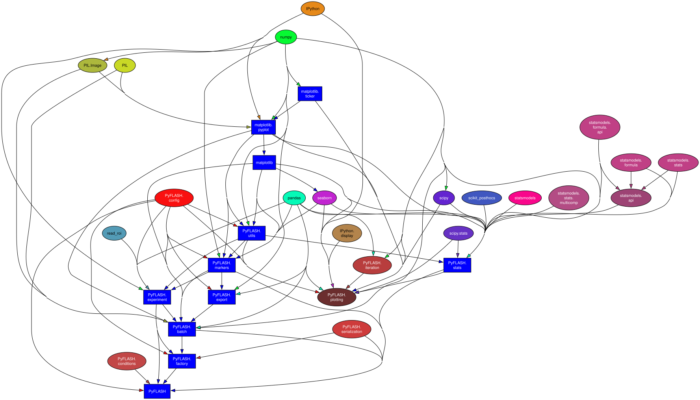

# PyFLASH

A Python package for processing and analyzing immunofluorescence (IF) confocal microscopy data exported from ImageJ. Built for the Brancaccio Lab at the UK Dementia Research Institute.

## What it does

Takes CSV exports from ImageJ's 3D Object Counter and other plugins, processes them into structured experiment/batch objects, performs statistical analysis, generates publication-quality plots, and exports formatted Excel summaries.



## Installation

```bash
pip install -e .
```

**Requires:** Python ≥ 3.9

**Dependencies:** pandas, numpy, matplotlib, seaborn, scipy, statsmodels, scikit-posthocs, openpyxl, read-roi, Pillow

## Quick start

```python
from PyFLASH import *
from PyFLASH.plotting import plot_mean_bars, plot_matrices, plot_location
from PyFLASH.utils import rc_params, get_columns

rc_params()

# Define experimental conditions (fluent builder)
conditions = (
    ConditionBuilder("Genotype")
    .add("WT", short="WT", color="blue")        # color names or hex
    .add("KO", short="KO", color="red")
    .compare("WT", "KO")                         # named, not '1-2'
    .explain("Wild-type vs knockout mice")
    .build()
)

# Or the classic API (still works):
# WT = condition('WT', 'WT', Config.COLORS['blue'], 'Genotype', 'Wild-type mice')
# KO = condition('KO', 'KO', Config.COLORS['red'], 'Genotype', 'Knockout mice')
# conditions = conditionList([WT, KO], comparisons=['1-2'])

# Create or load a batch
batch = create_batch(
    "My Experiment",
    conditions,
    batch_path="path/to/output",
    experiments={"Cohort1": "path/to/data1", "Cohort2": "path/to/data2"},
    pickle_path="path/to/cache",
)

# Analyse
cols = get_columns(batch.summary, column_strings=['Count', 'Volume'], exclude='NonColoc')
plot_mean_bars(batch, cols, specificity=('Time', 'WeekEight'))
plot_matrices(batch, cols)

# Export
batch.export_all_excel()
save_state(batch, "my_batch.pkl")
```

### Crossed (factorial) designs

```python
genotype = (
    ConditionBuilder("Genotype")
    .add("WT", short="WT", color="blue")
    .add("KO", short="KO", color="red")
    .compare("WT", "KO")
    .build()
)

treatment = (
    ConditionBuilder("Drug")
    .add("Vehicle", short="Veh")
    .add("Drug A", short="DrugA")
    .compare("Veh", "DrugA")
    .build()
)

crossed = (
    ConditionBuilder.cross(genotype, treatment)
    .compare("Veh", "DrugA", within="WT")    # drug effect in WT
    .compare("Veh", "DrugA", within="KO")    # drug effect in KO
    .compare("WT", "KO", within="Veh")       # genotype effect, no drug
    .build()
)
```

## Package structure

| Module | Purpose |
|---|---|
| `config.py` | Global configuration (thresholds, pixel size, colors) |
| `conditions.py` | Experimental conditions, `ConditionBuilder` fluent DSL |
| `markers.py` | Data marker classes (Antibody, cellMarker, objectMarker) |
| `experiment.py` | Single-experiment CSV import, ROI processing, summary building |
| `batch.py` | Multi-experiment batch processing and merging |
| `factory.py` | High-level `create_batch()` with pickle caching |
| `iteration.py` | Composable iteration framework for analysis actions |
| `plotting.py` | Publication-quality plots (bar charts, heatmaps, spatial plots, image panels) |
| `stats.py` | Statistical testing (t-test, ANOVA, Kruskal-Wallis, post-hoc comparisons) |
| `modelling.py` | Iterative best-fit model selection with LOO cross-validation |
| `export.py` | Formatted Excel export with human-readable column names |
| `serialization.py` | Pickle save/load with cross-machine path resolution |
| `image_io.py` | Multi-backend image loading (tifffile, cv2, imageio, PIL) |
| `_logging.py` | Unified output system with verbosity control (`set_verbosity`, `silent()`, `verbose()`) |
| `utils.py` | String, DataFrame, geometry, and plotting helpers |

## Controlling output

```python
import PyFLASH

# Set verbosity: 0=error, 1=warning, 2=info (default), 3=hint, 4=debug
PyFLASH.set_verbosity('debug')

# Silence all output for a block
with PyFLASH.silent():
    batch.export_all_excel()

# Maximize detail for a block
with PyFLASH.verbose():
    batch.processData()
```

## Data flow

```
Raw ImageJ exports (CSVs, ROI zips, images)
    → Experiment.processData()     — import, clean, compute colocalisation, build summary
    → Batch.processData()          — merge experiments, handle cross-experiment animals
    → Analysis & visualisation     — plot_mean_bars(), plot_matrices(), stats, modelling
    → Export                       — batch.export_all_excel(), save_state()
```

## Expected data layout

```
Data Analysis/
├── Objects/           # CSV files for objectMarker data
├── Cells/             # CSV files for cellMarker data
├── ROI Intensities/   # CSV files for ROI-level Antibody data
├── Attributes/        # CSV files for generic Attribute data
├── ROIs/              # ImageJ ROI zip files
└── Images/            # Microscopy images organized by animal/marker
```
