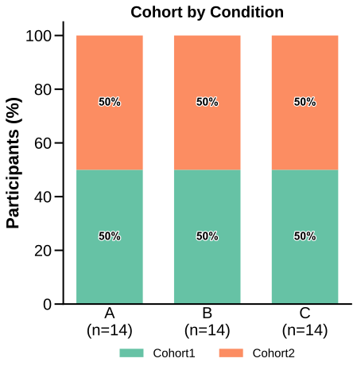

# plot_category_counts

## Summary

`plot_category_counts` draws grouped or stacked bars for one categorical summary
column. Registry name: `category_counts`.

Use it to check metadata balance, sample composition, or categorical annotation
frequencies across conditions or factor levels.

## Example figure

<!-- gallery-example-code:start -->
Gallery render call (after `ex = build_example_data(fig_path=TMP)`, `exp = ex.experiment`, and `P = PyFLASH.plotting`):

```python
P.plot_category_counts(
    exp,
    category="Cohort",
    factor="Condition",
    kind="stacked",
    normalize=True,
    save=True,
)
```
<!-- gallery-example-code:end -->



*Stacked cohort proportions across groups A/B/C. Rendered from the [synthetic example dataset](../examples/README.md).*

## Signature

```python
plot_category_counts(
    experiment,
    category,
    by="conditions",
    factor=None,
    kind="grouped",
    normalize=False,
    category_order=None,
    category_labels=None,
    palette=None,
    annotate=True,
    legend=True,
    specificity=None,
    filter_by=None,
    roi=None,
    save=True,
    conditions=None,
    condition_col="Condition",
    factor_cols=None,
    animal_col="AnimalName",
    group_list=None,
    groups=None,
    group_col=None,
    group_cols=None,
    subject_col=None,
    dataframe_kwargs=None,
)
```

## Parameters

| Parameter | Meaning |
|---|---|
| `experiment` | Batch, experiment-like object, or raw DataFrame. |
| `category` | Categorical summary column to count. |
| `by` / `factor` | Grouping mode or factor column for the x-axis. |
| `kind` | `"grouped"` for side-by-side bars or `"stacked"` for stacked bars. |
| `normalize` | Plot proportions instead of raw counts. |
| `category_order` | Optional order for category levels. |
| `category_labels` | Optional display labels for category levels. |
| `palette` | Optional colors for category levels. |
| `annotate`, `legend` | Toggle count/proportion labels and legend. |
| `filter_by` / `specificity`, `roi` | Optional row or ROI filtering. |
| `group_col`, `group_cols`, `subject_col`, `dataframe_kwargs` | DataFrame adapter metadata when passing a raw table. |

## Returns

With `save=True`, returns the saved SVG path or queue dictionary. With
`save=False`, returns the Matplotlib figure.

## Example

```python
from PyFLASH.plotting import plot_category_counts

plot_category_counts(
    batch,
    category="Sex",
    factor="Diagnosis",
    kind="stacked",
    normalize=True,
)
```

## Notes

This plot is describe-layer exempt because it is a descriptive count/proportion
view and does not compute inferential statistics.

## See Also

- [Table and categorical summary plots](../plot-types/table-and-categorical-summary-plots.md)
- [Conditions and factors](../parameters/conditions-and-factors.md)
- [Figure folders](../outputs/figure-folders.md)
