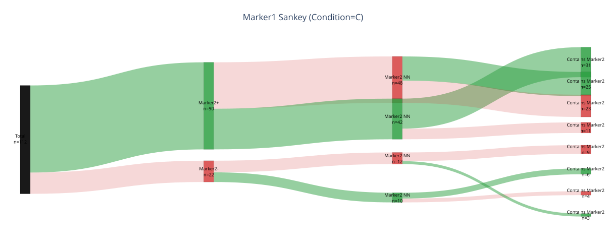

# plot_coloc_sankey

## Summary

`plot_coloc_sankey` detects binary colocalisation indicator columns for a marker
and plots a conditional branching Sankey, or alluvial, figure. It shows how rows
flow through each true/false indicator stage.

Registry name: `coloc_sankey`.

## Example figure



*Sankey flow of `Marker1`–`Marker2` colocalisation categories (group C). Rendered from the [synthetic example dataset](../examples/README.md).*

## Signature

```python
plot_coloc_sankey(
    source,
    marker,
    *,
    df=None,
    specificity=None,
    filter_by=None,
    roi=None,
    by=None,
    remove_closest=False,
    false_bottom=False,
    include_neither=True,
    min_count=1,
    normalize=False,
    order="auto",
    title=None,
    save=True,
    experiment=None,
    dpi=110,
)
```

## Input Object Types

| Object type | Accepted? | Notes |
|---|---:|---|
| `Batch` | Yes | Main supported input. Reads `source.data[marker].df`. |
| `Experiment` | Yes | Works with marker data and condition metadata. |
| `MiniExperiment` | Sometimes | Works only if the marker table has colocalisation indicator columns. |
| `pandas.DataFrame` | Yes | Used directly as the marker table. Pass `experiment` for save-path and grouping context when needed. |

## Parameters

| Parameter | Type | Default | Meaning |
|---|---|---:|---|
| `source` | PyFLASH-like object or `DataFrame` | required | Marker data source. |
| `marker` | `str` or list-like | required | Base marker. A list queues one Sankey plot per marker. |
| `df` | `pandas.DataFrame` or `None` | `None` | Optional pre-filtered marker table override for one marker. |
| `filter_by` | dict, tuple, list, or `None` | `None` | Preferred row filter. Lists run queue mode. Legacy alias: `specificity`. |
| `roi` | `str`, list-like, or `None` | `None` | ROI-base selector. Multiple ROI bases run queue mode. |
| `by` | `str` or `None` | `None` | Group panels. `None` auto-groups by condition only when multiple conditions remain. |
| `remove_closest` | `bool` | `False` | Exclude `<marker>_ClosestTo_<other>` columns. |
| `false_bottom` | `bool` | `False` | Force true nodes above false nodes within each layer. |
| `include_neither` | `bool` | `True` | Include false branches. `False` keeps only true branches. |
| `min_count` | `int` | `1` | Hide branches with fewer rows. Values below 1 are clamped to 1. |
| `normalize` | `bool` | `False` | Use percent of panel rows for link values instead of raw counts. |
| `order` | `str` or list-like | `"auto"` | Indicator order. Accepted strings include `"auto"`, `"detected"`, `"stable"`, `"alphabetical"`, and `"alpha"`. |
| `title` | `str` or `None` | `None` | Base plot title. |
| `save` | `bool` | `True` | Save figures when an experiment context is available. |
| `experiment` | PyFLASH-like object or `None` | `None` | Legacy/context object for DataFrame input and saving. |
| `dpi` | `int` | `110` | Used to scale saved Plotly figure size. |

## Returns

| Return value | Type | Meaning |
|---|---|---|
| `fig` | `plotly.graph_objects.Figure` | Returned for one combined panel. |
| `outputs` | `dict` | Returned when grouped, queued, or run over several markers. Values are Plotly figures or nested dictionaries. |

## Saved Outputs

With `save=True` and an experiment context, figures are saved under a `Sankey`
plot folder below `exp_obj.fig_path`. The save helper tries Plotly static image
export first and falls back to HTML when static export is unavailable.

Saved names include:

- `rawcounts` or `normalized`;
- `withFalse` or `trueOnly`;
- `withClosest` or `noClosest`;
- `falseBottom` or `flowOrder`;
- condition or factor tags when grouped;
- row-filter and ROI suffixes when relevant.

The function requires the optional `plotly` package.

## Examples

### Plot one marker without saving

```python
from PyFLASH.plotting import plot_coloc_sankey

fig = plot_coloc_sankey(
    batch,
    marker="GFAP",
    include_neither=True,
    save=False,
)
```

### Make one plot per condition

```python
figures = plot_coloc_sankey(
    batch,
    marker="GFAP",
    by="conditions",
    remove_closest=True,
    normalize=True,
    save=True,
)

print(figures.keys())
```

### Control indicator order

```python
fig = plot_coloc_sankey(
    batch,
    marker="GFAP",
    order=[
        "GFAP_ColocCountDAPI",
        "GFAP_Contains_mCherry",
    ],
    include_neither=False,
    save=False,
)
```

## Notes

- Detected indicator columns follow these patterns:
  `<marker>_ColocCount<other>`, `<marker>_ClosestTo_<other>`, and
  `<marker>_Contains_<other>`.
- Boolean coercion accepts booleans, 0/1-style numeric values, and common text
  values such as `"true"`, `"false"`, `"yes"`, and `"no"`.
- With `include_neither=False`, false branches are omitted. This focuses the
  plot on positive colocalisation paths but hides the all-false population.
- When `normalize=True`, node labels still include counts, while link values use
  percent of the current panel.
- The plot is describe-layer exempt because it is a descriptive flow view.

## See Also

- [Colocalisation and composition plots](../plot-types/colocalisation-plots.md)
- [Marker tables](../data-structures/marker-tables.md)
- [plot_coloc_upset](plot_coloc_upset.md)
- [plot_combo_pies](plot_combo_pies.md)
