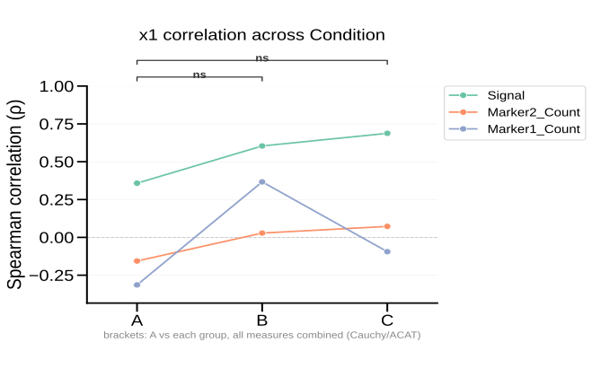

# plot_correlation_contrast

## Summary

`plot_correlation_contrast` contrasts how the correlation between an anchor
variable `x` and each of several measures `y` changes across an ordered grouping
factor — a slopegraph of the coefficient per group. Every non-reference group is
tested against the reference with a **Fisher r-to-z** test for two independent
correlations. `significance` chooses how that is drawn — one comparison line per
significant measure per group (the default), per-measure stars at each node, or
one omnibus **Cauchy/ACAT** comparison bracket per group (combining all measures)
floating above the axis. It is registered
as `correlation_contrast` in `PyFLASH.spec.PLOT_REGISTRY`.

Use it to show a coupling that is present in one group and lost in others (e.g.
brain-region volume vs activity coupling that weakens across a disease spectrum).

## Example figure

<!-- gallery-example-code:start -->
Gallery render call (after `ex = build_example_data(fig_path=TMP)`, `exp = ex.experiment`, and `P = PyFLASH.plotting`):

```python
P.plot_correlation_contrast(
    exp,
    x="x1",
    y=["Signal", "Marker1_Count", "Marker2_Count"],
    factor="Condition",
    reference="A",
    significance="omnibus",
    save=True,
)
```
<!-- gallery-example-code:end -->



*Correlation of `x1` with three measures across conditions A/B/C, contrasted vs
reference A with ACAT omnibus brackets (`significance="omnibus"`). Rendered from
the [synthetic example dataset](../examples/README.md).*

## Signature

```python
plot_correlation_contrast(
    experiment,
    x,
    y=None,
    filtered_columns=None,
    data_cols=None,
    by="conditions",
    factor=None,
    reference=None,
    control=None,
    test="spearmanr",
    covariates=None,
    tail="two",
    group_order=None,
    significance="lines",
    min_n=4,
    palette=None,
    column_labels=None,
    x_axis_width_scale=0.8,
    node_size=10.0,
    show_ci=True,
    ci_alpha=0.05,
    show_stats_summary=True,
    stats_summary_max_items=10,
    specificity=None,
    split_by=None,
    filter_by=None,
    roi=None,
    save=True,
    column_strings=None,
    regex_string=None,
    exclude="",
    data_col_contains=None,
    data_col_regex=None,
    data_col_exclude=None,
    condition_col="Condition",
    factor_cols=None,
    animal_col="AnimalName",
    group_list=None,
    groups=None,
    group_col=None,
    group_cols=None,
    subject_col=None,
    dataframe_kwargs=None,
)
```

## Input Object Types

| Object type | Accepted? | Notes |
|---|---:|---|
| `Batch` | Yes | Main supported input. Uses `summary`, `condition_list`, and `fig_path`. |
| `Experiment` | Yes | Works when it exposes the same summary and condition attributes. |
| `MiniExperiment` | Usually | Works for summary-style data when required columns exist. |
| `pandas.DataFrame` | Yes | Provide `group_col` and `subject_col`, or a `groupList`/`groups`. |

## Parameters

| Parameter | Type | Default | Meaning |
|---|---|---:|---|
| `experiment` | `Batch`, `Experiment`, or `pandas.DataFrame` | required | Data source. |
| `x` | `str` | required | Anchor column correlated against every measure (one column). |
| `y` | `str`, list-like, or `None` | `None` | Measure column(s). If `None`, measures are discovered from `filtered_columns` / `column_strings` / `regex_string`. |
| `factor` | `str` or `None` | `None` | Grouping factor whose ordered levels form the x-axis (e.g. `"Diagnosis"`). Without it, conditions are used. Alias: `split_by`. |
| `reference` | `str` or `None` | `None` | Baseline group every other group is contrasted against. Defaults to the first group. Alias: `control`. |
| `test` | `str` | `"spearmanr"` | Correlation statistic: `"pearsonr"`, `"spearmanr"`, or `"kendalltau"` (aliases `p`/`s`/`k`). |
| `covariates` | list-like or `None` | `None` | Adjustment columns for partial correlation. `x` and each measure are residualised on these within each group (numeric kept as-is, categorical one-hot encoded). Omit for raw correlations. |
| `significance` | `"lines"`, `"stars"`, `"omnibus"`, or `None` | `"lines"` | How to draw the Fisher r-to-z result: `"lines"` = one comparison line per significant measure per group (reference→group), stacked above the axis, so each mark names its contrast; `"stars"` = per-measure stars at each node; `"omnibus"` = one Cauchy/ACAT comparison bracket per group vs the reference; `None` = neither. |
| `group_order` | list-like or `None` | `None` | Explicit left-to-right ordering (and subset) of the groups; defaults to the factor/condition order. |
| `min_n` | `int` | `4` | Minimum `n` per group × measure required to compute a correlation. |
| `palette` | dict, `str`, or `None` | `None` | Measure colours: a `{measure: colour}` dict or a seaborn palette name (default `"Set2"`). |
| `column_labels` | dict, list-like, or `None` | `None` | Display-name overrides for plotted measure labels. |
| `x_axis_width_scale` | number | `0.8` | Multiplier for the plotted x-axis/data-region width only. Lower values pull group ticks closer together without changing the figure size; `1.0` restores the original spacing. |
| `node_size` | number | `10.0` | Marker diameter for the group nodes, in points. |
| `show_ci` | `bool` | `True` | Draw per-node confidence intervals with short horizontal caps. |
| `ci_alpha` | number | `0.05` | Alpha level for confidence intervals; `0.05` draws 95% intervals. |
| `show_stats_summary` | `bool` | `True` | Draw the removable right-side block with exact Fisher/ACAT p-values and node CI bounds. |
| `stats_summary_max_items` | `int` | `10` | Maximum number of detailed side-panel result rows before an omitted-count line. |
| `filter_by` | dict, tuple, queue, or `None` | `None` | Row filter before grouping. Alias: `specificity`. |
| `roi` | `str`, list-like, or `None` | `None` | ROI-base selector. Multiple ROI bases return a queue dictionary. |
| `save` | `bool` | `True` | Save the SVG figure under the input object's figure folder. |
| `data_col_contains` | `str`, list-like, or `None` | `None` | Discover measures whose names contain these strings (used when `y` is omitted). Alias: `column_strings`. |
| `group_col` | `str` or `None` | `None` | Grouping column for raw DataFrame input. Alias: `condition_col`. |
| `subject_col` | `str` or `None` | `None` | Subject/sample ID column for raw DataFrame input. Alias: `animal_col`. |
| `dataframe_kwargs` | `dict` or `None` | `None` | Advanced `from_dataframe` options. |

## Returns

| Return value | Type | Meaning |
|---|---|---|
| fig | `matplotlib.figure.Figure` | The correlation-contrast slopegraph. |
| queued result | `dict` | When `roi` or `filter_by` is queued, returns nested dictionaries keyed by ROI base or filter. |

## Saved Outputs

When `save=True`, one SVG is written below `experiment.fig_path`, normally in a
`Correlation Contrast` subfolder:

```text
Correlation Contrast <x>.svg
```

Factor and row-filter contexts are encoded into filename suffixes. When several
ROI bases are queued, the ROI base is prepended as a top-level folder.

A slopegraph carries one node per group, so the plotted data region is
deliberately narrower than most PyFLASH plots — the figure canvas is unchanged,
but the axes box is sized from the x-span so the gap between group ticks stays
the same whether there are two groups or five. The legend and stats block sit in
the space this frees on the right. Use `x_axis_width_scale` to tune that plotted
x-axis width without changing the total figure size.

By default, each node also carries a confidence interval for the plotted
correlation. The interval is drawn vertically in the measure colour with short
horizontal caps so it stays readable without widening the slopegraph. Set
`show_ci=False` for a cleaner node-only graph.

## Statistics

- Per group × measure, the correlation is computed with the chosen `test`. With
  `covariates`, both `x` and the measure are residualised on the covariates
  within the group first (partial correlation).
- Per-node confidence intervals are computed on the Fisher-z scale, transformed
  back to correlation units, and clipped to `[-1, 1]`.
- Each non-reference group is compared to `reference` per measure with a **Fisher
  r-to-z** test for two independent correlations
  (`stats.fisher_z_correlation_difference`). Spearman uses the Bonett & Wright
  (2000) variance; Pearson/Kendall use the classic `1/(n-3)`.
- `significance="omnibus"` combines the per-measure p-values for a group into one
  value with the **Cauchy combination test** (`stats.cauchy_combination_test`),
  which is valid under dependence among the (correlated) measures.
- The related `stats.zou_correlation_difference_ci` returns a Zou (2007)
  confidence interval for the difference of two correlations.

## Examples

### Coupling contrast across a diagnosis factor

```python
from PyFLASH.plotting import plot_correlation_contrast

fig = plot_correlation_contrast(
    batch,
    x="HippocampalVolume",
    y=["Totalcounts", "Amplitude", "M10"],
    factor="Diagnosis",
    reference="Control",
    test="spearmanr",
    significance="omnibus",
    save=False,
)
```

### Age/sex-adjusted (partial) correlations

```python
fig = plot_correlation_contrast(
    batch,
    x="HippocampalVolume",
    y=["Totalcounts", "Amplitude"],
    factor="Diagnosis",
    reference="Control",
    covariates=["Age", "Sex"],
    save=False,
)
```

### Discover measures by substring instead of listing them

```python
fig = plot_correlation_contrast(
    batch,
    x="HippocampalVolume",
    column_strings=["counts", "Amplitude"],
    factor="Diagnosis",
    reference="Control",
)
```

## Notes

- `x` is a single anchor column; `y` (or the discovered columns) are the measures,
  one line each. `x` and any `covariates` are removed from the measure set
  automatically.
- `reference` must match one of the resolved group labels, unless it is omitted
  (then the first group is used).
- `correlation_contrast` is describe-layer **covered**: it emits one correlation
  record per group × measure into `PyFLASH.report` when the collector is armed.

## See Also

- [Regression and correlation plots](../plot-types/regression-plots.md)
- [`plot_regressions`](plot_regressions.md)
- [`plot_matrix_differences`](plot_matrix_differences.md)
- [`adjusted_correlation`](adjusted_correlation.md)
- [Groups and factors](../parameters/conditions-and-factors.md)
