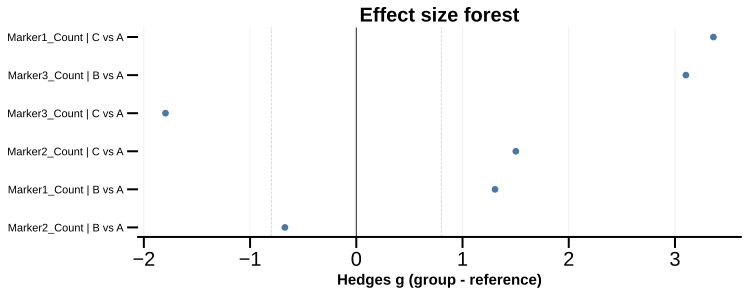

# plot_effect_forest

## Summary

`plot_effect_forest` computes subject-level Hedges g for each selected marker and
each group-vs-control contrast, then draws a ranked forest plot. It is registered
as `effect_forest` in `PyFLASH.spec.PLOT_REGISTRY`.

Use it to see which markers have the largest descriptive group differences.

## Example figure



*Hedges g effect sizes vs control A for three markers. Rendered from the [synthetic example dataset](../examples/README.md).*

## Signature

```python
plot_effect_forest(
    experiment,
    filtered_columns=None,
    data_cols=None,
    by="conditions",
    factor=None,
    specificity=None,
    split_by=None,
    filter_by=None,
    roi=None,
    control=None,
    alpha=0.05,
    max_items=30,
    effect_ci=True,
    n_resamples=2000,
    min_n=3,
    tick_label_size=20,
    save=True,
    column_strings=None,
    regex_string=None,
    exclude="",
    data_col_contains=None,
    data_col_regex=None,
    data_col_exclude=None,
    condition_col="Condition",
    factor_cols=None,
    animal_col="AnimalName",
    group_list=None,
    groups=None,
    group_col=None,
    group_cols=None,
    subject_col=None,
    dataframe_kwargs=None,
)
```

## Input Object Types

| Object type | Accepted? | Notes |
|---|---:|---|
| `Batch` | Yes | Main supported input. Uses `summary`, `condition_list`, and `fig_path`. |
| `Experiment` | Yes | Works when it exposes the same summary and condition attributes. |
| `MiniExperiment` | Usually | Works for summary-style data when required columns exist. |
| `pandas.DataFrame` | Yes | Provide `group_col` and `subject_col`, or a `groupList`/`groups`. |

## Parameters

| Parameter | Type | Default | Meaning |
|---|---|---:|---|
| `experiment` | `Batch`, `Experiment`, or `pandas.DataFrame` | required | Data source. |
| `data_cols` | list-like or `None` | `None` | Exact data columns to analyze. Preferred public name. |
| `filtered_columns` | list-like or `None` | `None` | Exact summary columns to compare. Internal/legacy name. |
| `by` | `str` | `"conditions"` | Grouping mode. Common values are `"conditions"` and `"all"`. |
| `factor` | `str` or `None` | `None` | Group by a factor column instead of main condition groups. |
| `split_by` | `str` or `None` | `None` | Public grouping alias. Values such as a column name usually resolve to `factor`. |
| `filter_by` | dict, tuple, queue, or `None` | `None` | Preferred public row filter before grouping. Legacy alias: `specificity`. |
| `roi` | `str`, list-like, or `None` | `None` | ROI-base selector. Multiple ROI bases return a queue dictionary. |
| `control` | `str` or `None` | `None` | Reference group. If omitted, the first resolved group is used. Matching is case-insensitive. |
| `alpha` | number | `0.05` | Kept for the shared renderer. The standalone forest does not mark significance because it has no p-value column. |
| `max_items` | `int` or `None` | `30` | Maximum rows to display after ranking by absolute effect size. |
| `effect_ci` | `bool` | `True` | Compute bootstrap confidence intervals for Hedges g. |
| `n_resamples` | `int` | `2000` | Bootstrap resamples used when `effect_ci=True`. |
| `min_n` | `int` | `3` | Minimum finite subject-level values required in both reference and comparison groups. |
| `tick_label_size` | number | `20` | Base font size for labels and title. |
| `save` | `bool` | `True` | Save the SVG figure under the input object's figure folder. |
| `group_col` | `str` or `None` | `None` | Preferred public grouping column. Legacy alias: `condition_col`. |
| `group_cols` | list-like or `None` | `None` | Preferred public crossed-group columns. Legacy alias: `factor_cols`. |
| `subject_col` | `str` or `None` | `None` | Subject/sample ID column. Legacy alias: `animal_col`. |
| `group_list` | `groupList` or `None` | `None` | Optional group metadata for raw DataFrame input. |
| `groups` | `groupList` or `None` | `None` | Alternative public spelling for `group_list`. |
| `data_col_contains` | `str`, list-like, or `None` | `None` | Include data columns whose names contain these strings. Preferred public name. |
| `data_col_regex` | `str` or `None` | `None` | Include data columns matching this regex. Preferred public name. |
| `data_col_exclude` | `str`, list-like, or `None` | `None` | Exclude matching data columns after selection. Preferred public name. |
| `condition_col` | `str` | `"Condition"` | Legacy alias for `group_col`. |
| `factor_cols` | list-like or `None` | `None` | Legacy alias for `group_cols`. |
| `animal_col` | `str` | `"AnimalName"` | Legacy alias for `subject_col`. |
| `column_strings` | `str`, list-like, or `None` | `None` | Legacy/internal alias for `data_col_contains`. |
| `regex_string` | `str` or `None` | `None` | Legacy/internal alias for `data_col_regex`. |
| `exclude` | `str` or list-like | `""` | Legacy/internal alias for `data_col_exclude`. |
| `dataframe_kwargs` | `dict` or `None` | `None` | Advanced `from_dataframe` options. |

## Returns

| Return value | Type | Meaning |
|---|---|---|
| fig | `matplotlib.figure.Figure` | Forest plot figure. |
| `None` | `None` | Returned when no finite effect sizes are available. |
| queued result | `dict` | When `roi` or `filter_by` is queued, returns nested dictionaries keyed by ROI base or filter. |

## Saved Outputs

When `save=True`, one SVG is written below `experiment.fig_path`, normally in an
`Effect Forest` subfolder.

Common filename:

```text
Effect Size Forest.svg
```

Specificity and ROI suffixes are added when those filters are active.

## Examples

### Plot a forest from a processed batch

```python
from PyFLASH.plotting import plot_effect_forest

fig = plot_effect_forest(
    batch,
    data_cols=["GFAP_Count", "Iba1_Count"],
    control="Control",
    save=False,
)
```

### Use a raw summary DataFrame

```python
fig = plot_effect_forest(
    df,
    data_cols=["GFAP_Count", "Iba1_Count"],
    group_col="Diagnosis",
    subject_col="Subject ID",
    control="Control",
    min_n=2,
    save=False,
)
```

### Disable bootstrap intervals for speed

```python
fig = plot_effect_forest(
    batch,
    data_col_contains=["Count", "Volume"],
    control="Control",
    effect_ci=False,
    max_items=20,
)
```

### Reuse the returned figure

```python
fig = plot_effect_forest(batch, data_cols=["GFAP_Count"], save=False)

if fig is not None:
    fig.axes[0].set_xlabel("Hedges g vs reference")
```

## Notes

- Hedges g is computed as `comparison group - reference group`. Positive values
  mean the comparison group is higher than the control.
- The bootstrap confidence interval resamples subject-level summary values.
- `control` must match one of the resolved group labels, unless it is omitted.
- `effect_forest` is describe-layer exempt as a standalone descriptive plot.
  The inferential, structured-results version lives in
  [`group_comparison`](group_comparison.md).

## See Also

- [Group comparison plots](../plot-types/group-comparison-plots.md)
- [`plot_group_matrix`](plot_group_matrix.md)
- [`plot_superplot`](plot_superplot.md)
- [`group_comparison`](group_comparison.md)
- [Column selection](../parameters/column-selection.md)
- [Groups and factors](../parameters/conditions-and-factors.md)
- [Effect sizes](../statistics/effect-sizes.md)
