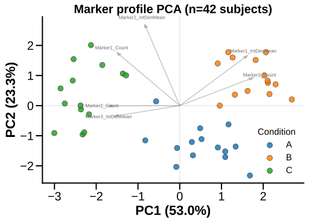

# plot_marker_pca

## Summary

`plot_marker_pca` draws a PCA biplot of subject-level marker profiles. It is
registered as `marker_pca`.

Use it to see whether selected summary columns separate subjects or groups along
the first two principal components, and which features contribute to those
components.

## Example figure



*PCA of the six marker metrics (42 subjects), coloured by group. Rendered from the [synthetic example dataset](../examples/README.md).*

## Signature

```python
plot_marker_pca(batch, columns=None, data_cols=None, column_strings=None, regex_string=None, exclude='', data_col_contains=None, data_col_regex=None, data_col_exclude=None, hue_column='Condition', specificity=None, filter_by=None, standardize=True, n_components=2, annotate_loadings=True, max_loadings=12, palette=None, title=None, save=False, save_path=None, save_name=None, dpi=600, return_data=False, condition_col='Condition', factor_cols=None, animal_col='AnimalName', group_list=None, groups=None, group_col=None, group_cols=None, subject_col=None, dataframe_kwargs=None)
```

## Input Object Types

| Object type | Accepted? | Notes |
|---|---:|---|
| `Batch` | Yes | Main supported input. Reads `batch.summary`. |
| `Experiment` | Yes | Works when it exposes a non-empty `.summary`. |
| `MiniExperiment` | Yes | Works for summary-style data. |
| `pandas.DataFrame` | Yes | Wrapped internally; pass `group_col` and `subject_col` when needed. |

## Parameters

| Parameter | Type | Default | Meaning |
|---|---|---|---|
| `batch` | `Batch`, experiment-like object, or `DataFrame` | required | Data source containing a summary table. |
| `data_cols` / `columns` | list-like or `None` | `None` | Numeric feature columns for PCA. |
| `data_col_contains`, `data_col_regex`, `data_col_exclude` | string/list filters | `None`, `None`, `None` | Discover feature columns. |
| `hue_column` | string | `'Condition'` | Summary column used to color points. If missing, all points use one level. |
| `filter_by` / `specificity` | mapping, tuple, list, or `None` | `None` | Row filter before PCA. |
| `standardize` | bool | `True` | Standardize each feature to mean 0 and unit scale before PCA. |
| `n_components` | int | `2` | Number of principal components to compute; at least the first two are plotted. |
| `annotate_loadings` | bool | `True` | Draw loading arrows for influential features. |
| `max_loadings` | int | `12` | Maximum number of loading arrows to label. |
| `palette` | dict or `None` | `None` | Optional color map for `hue_column` values. |
| `title` | string or `None` | `None` | Custom title. |
| `save`, `save_path`, `save_name`, `dpi` | saving options | `False`, `None`, `None`, `600` | Figure saving controls. |
| `return_data` | bool | `False` | Return PCA data with the figure. |

## Returns

| Return value | Type | Meaning |
|---|---|---|
| `fig` | `matplotlib.figure.Figure` | PCA biplot. |
| `(fig, data)` | tuple | Returned when `return_data=True`. |
| `data["scores"]` | `pandas.DataFrame` | PC1/PC2 scores with the hue column. |
| `data["loadings"]` | `pandas.DataFrame` | Feature loadings for PC1 and PC2. |
| `data["explained_variance"]` | array-like | Explained variance ratios from scikit-learn PCA. |

## Saved Outputs

`save=False` by default. With `save=True`, PyFLASH writes an SVG figure to
`save_path` when supplied. Otherwise it uses `batch.fig_path`, then
`batch.data_path`, then the current folder.

The default filename stem is `marker_pca`; pass `save_name` to override it.

## Examples

Minimal PCA:

```python
from PyFLASH.plotting import plot_marker_pca

fig = plot_marker_pca(
    batch,
    data_cols=["GFAP_Count", "Iba1_Count", "NeuN_Count"],
)
```

Raw DataFrame with returned PCA tables:

```python
fig, data = plot_marker_pca(
    df,
    data_cols=["GFAP_Count", "Iba1_Count", "NeuN_Count", "Abeta_Area"],
    group_col="Diagnosis",
    subject_col="AnimalName",
    hue_column="Diagnosis",
    return_data=True,
)
```

Inspect loadings:

```python
loadings = data["loadings"].sort_values("PC1", key=abs, ascending=False)
print(loadings.head())
```

## Notes

The function needs at least two numeric feature columns and at least three
complete rows after filtering and numeric coercion. Rows with any missing
selected feature are dropped from the PCA matrix.

`standardize=True` is usually appropriate for immunofluorescence summaries
because count, area, and intensity columns can have very different scales.

This registry entry is currently describe-layer `unreviewed`; use
`return_data=True` when you need machine-readable PCA scores or loadings.

## See Also

- [Model Summary Plots](../plot-types/model-summary-plots.md)
- [Column selection](../parameters/column-selection.md)
- [Filter By and row filters](../parameters/specificity.md)
- [Summary table](../data-structures/summary-table.md)
- [Linear models](../statistics/linear-models.md)
