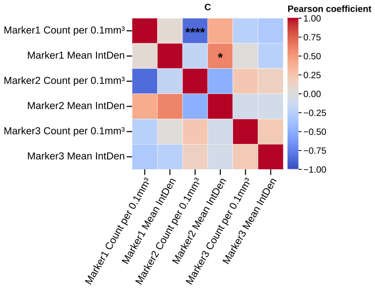

# plot_matrices

## Summary

`plot_matrices` draws square correlation heatmaps for selected numeric columns.
It is registered as `matrices` in `PyFLASH.spec.PLOT_REGISTRY`.

Use it for a quick visual overview of pairwise marker or summary-column
relationships within each condition, factor level, or pooled group.

## Example figure



*All-vs-all Pearson correlation matrix of the six marker metrics (group A). Rendered from the [synthetic example dataset](../examples/README.md).*

## Signature

```python
plot_matrices(experiment, filtered_columns=None, data_cols=None, by='conditions', factor=None, split_by=None, correlation='pearsonr', first_columns=None, tick_label_size=20, leading_data_cols=None, marker=None, specificity=None, filter_by=None, roi=None, save=True, column_strings=None, regex_string=None, exclude='', data_col_contains=None, data_col_regex=None, data_col_exclude=None, prefix_order=None, marker_order=None, share_columns_across_panels=True, triangle=None, show_diagonal=True, show_values=False, value_format='.2f', conditions=None, condition_col='Condition', factor_cols=None, animal_col='AnimalName', group_list=None, groups=None, group_col=None, group_cols=None, subject_col=None, dataframe_kwargs=None)
```

## Input Object Types

| Object type | Accepted? | Notes |
|---|---:|---|
| `Batch` | Yes | Main supported input. Reads `batch.summary`; `roi` can select from ROI summaries. |
| `Experiment` | Yes | Works when the object exposes `.summary`, `.condition_list`, and figure paths. |
| `MiniExperiment` | Yes | Works for summary-style imported data when required columns exist. |
| `pandas.DataFrame` | Yes | Wrapped internally; pass `group_col` and `subject_col` when the table is not already PyFLASH-shaped. |

## Parameters

| Parameter | Type | Default | Meaning |
|---|---|---|---|
| `experiment` | `Batch`, experiment-like object, or `DataFrame` | required | Data source containing a subject-level summary table. |
| `data_cols` | list-like or `None` | `None` | Exact numeric columns for the matrix. `filtered_columns` remains supported for older code. |
| `data_col_contains`, `data_col_regex`, `data_col_exclude` | string/list filters | `None`, `None`, `None` | Discover columns by substring, regular expression, and exclusion token. |
| `by` / `split_by` | string | `'conditions'` | Panel by conditions, by `"all"`, or by a factor-style column. |
| `factor` | string or `None` | `None` | Explicit factor column for factor-level panels. |
| `correlation` | string | `'pearsonr'` | Accepted values: Pearson, Spearman, Kendall, or aliases `p`, `s`, `k`. |
| `first_columns` / `leading_data_cols` | list-like or `None` | `None` | Pin selected columns at the start of the matrix before sorting the rest. |
| `marker` | string or `None` | `None` | Read a marker-level table instead of `summary`. |
| `filter_by` / `specificity` | mapping, tuple, list, or `None` | `None` | Row filter or filter queue. |
| `roi` | string, list, or `None` | `None` | Select one ROI summary or run an ROI queue. |
| `share_columns_across_panels` | bool | `True` | Keep only columns valid in every panel so panels are comparable. |
| `triangle` | `None`, `'full'`, `'lower'`, `'upper'` | `None` | Mask one side of the matrix for compact display. |
| `show_diagonal` | bool | `True` | Show self-correlation cells. |
| `show_values` | bool | `False` | Write formatted numeric coefficients inside visible cells. |
| `value_format` | string or callable | `'.2f'` | Format for `show_values`. |
| `save` | bool | `True` | Write SVG figures to disk. |
| `group_col`, `group_cols`, `subject_col` | strings/list or `None` | `None` | DataFrame-adapter aliases for group, crossed-group, and subject columns. |

## Returns

| Return value | Type | Meaning |
|---|---|---|
| `result` | `dict` | Plot-run output keyed by condition, factor level, `"Combined"`, ROI, or filter-queue item depending on the call. Leaf results contain `heatmap` and `correlations`. |
| `result[panel]["correlations"]` | `dict` | Pair names such as `"GFAP_Count vs Iba1_Count"` mapped to `(p_value, coefficient)`. |

## Saved Outputs

With `save=True`, PyFLASH writes SVG heatmaps below the input object's figure
folder. The normal subfolder is `Matrices/`, with extra path or filename tags
for factor grouping, row filters, and ROI selection.

Filenames include the panel name, correlation method, optional triangle/value
variant label, and `Correlation Matrix`. If HTML export is enabled globally,
the function also attempts an HTML matrix export.

## Examples

Minimal preview:

```python
from PyFLASH.plotting import plot_matrices

result = plot_matrices(
    batch,
    data_cols=["GFAP_Count", "Iba1_Count", "NeuN_Count"],
    save=False,
)
```

Raw DataFrame with condition panels:

```python
from PyFLASH.plotting import plot_matrices

result = plot_matrices(
    df,
    data_cols=["GFAP_Count", "Iba1_Count", "NeuN_Count"],
    group_col="Diagnosis",
    subject_col="AnimalName",
    split_by="Diagnosis",
    correlation="spearman",
    show_values=True,
    save=False,
)
```

Inspect a coefficient:

```python
control = result.get("Control") or next(iter(result.values()))
p_value, r_value = control["correlations"]["GFAP_Count vs Iba1_Count"]
print(r_value, p_value)
```

## Notes

`plot_matrices` drops non-numeric and sentinel-excluded values before
correlation. If fewer than two valid numeric columns remain in a panel, that
panel shows a "not enough valid numeric columns" message and returns an empty
correlation dictionary.

Significance stars are drawn from the selected pairwise correlation p-values.
The registry entry is currently describe-layer `unreviewed`, so use the return
dictionary or a pipeline result when you need structured numeric records.

For saved CSV matrices and significance-gated regression selection, use
[`correlation`](correlation.md) or [`adjusted_correlation`](adjusted_correlation.md).

## See Also

- [Matrix Plots](../plot-types/matrix-plots.md)
- [Column selection](../parameters/column-selection.md)
- [Groups and factors](../parameters/conditions-and-factors.md)
- [Filter By and row filters](../parameters/specificity.md)
- [ROI selection](../parameters/roi.md)
- [Correlation statistics](../statistics/correlation.md)
