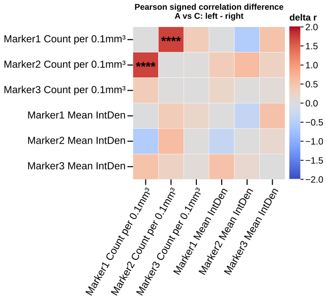

# plot_matrix_differences

## Summary

`plot_matrix_differences` compares correlation matrices between groups. It is
registered as `matrix_differences`.

For each requested comparison, it computes each group's correlation matrix and
then summarizes `left - right` and `abs(left - right)` for every cell. Pearson
matrices can also receive Fisher r-to-z p-values, FDR q-values, and gate
matrices.

## Example figure

<!-- gallery-example-code:start -->
Gallery render call (after `ex = build_example_data(fig_path=TMP)`, `exp = ex.experiment`, and `P = PyFLASH.plotting`):

```python
P.plot_matrix_differences(
    exp,
    filtered_columns=[
        "Marker1_Count",
        "Marker2_Count",
        "Marker3_Count",
        "Marker1_IntDenMean",
        "Marker2_IntDenMean",
        "Marker3_IntDenMean",
    ],
    comparisons=[("A", "C")],
    save=True,
)
```
<!-- gallery-example-code:end -->



*Signed correlation-matrix difference between groups A and C (Fisher z). Rendered from the [synthetic example dataset](../examples/README.md).*

## Signature

```python
plot_matrix_differences(experiment, filtered_columns=None, data_cols=None, against_columns=None, against_data_cols=None, by='conditions', factor=None, comparisons=None, specificity=None, split_by=None, filter_by=None, roi=None, save=True, column_strings=None, regex_string=None, exclude='', data_col_contains=None, data_col_regex=None, data_col_exclude=None, against_column_strings=None, against_regex_string=None, against_exclude='', against_data_col_contains=None, against_data_col_regex=None, against_data_col_exclude=None, correlation='pearsonr', alpha=0.05, min_n=3, difference_gate='p', difference_test='fisher_z', plot_signed=True, plot_absolute=True, value_matrices='p', plot_pvalue_matrices=None, plot_qvalue_matrices=None, plot_gate_matrix=True, tick_label_size=20, run_label=None, condition_col='Condition', factor_cols=None, animal_col='AnimalName', group_list=None, groups=None, group_col=None, group_cols=None, subject_col=None, dataframe_kwargs=None)
```

## Input Object Types

| Object type | Accepted? | Notes |
|---|---:|---|
| `Batch` | Yes | Main supported input. |
| `Experiment` | Yes | Works with `.summary`, `.condition_list`, and figure paths. |
| `MiniExperiment` | Yes | Works for summary-style data. |
| `pandas.DataFrame` | Yes | Wrapped internally; pass `group_col` and `subject_col` when needed. |

## Parameters

| Parameter | Type | Default | Meaning |
|---|---|---|---|
| `experiment` | `Batch`, experiment-like object, or `DataFrame` | required | Data source containing a summary table. |
| `data_cols` | list-like or `None` | `None` | Row-side columns. In square mode these also form the column side. Alias: `filtered_columns`. |
| `against_data_cols` | list-like or `None` | `None` | Optional column-side set for rectangular matrix differences. Alias: `against_columns`. |
| `split_by` | string | `'conditions'` | Grouping source used to build matrices. Alias: `by`. |
| `factor` | string or `None` | `None` | Explicit factor column for group matrices. |
| `comparisons` | list-like or `None` | `None` | Pairwise group comparisons. Strings such as `"1-2"` use the current group order. |
| `correlation` | string or sequence | `'pearsonr'` | One or more methods: Pearson, Spearman, Kendall, or aliases. |
| `alpha` | float | `0.05` | Significance threshold for p/q gates and annotations. |
| `min_n` | int | `3` | Minimum complete pairs for each group-level correlation. |
| `difference_gate` | string | `'p'` | Gate source for difference significance: raw p-values or FDR q-values. |
| `difference_test` | string | `'fisher_z'` | Difference-test backend. Currently inferential for Pearson; other methods are descriptive. |
| `plot_signed`, `plot_absolute` | bool | `True`, `True` | Save signed and absolute difference heatmaps. |
| `value_matrices` | string | `'p'` | Which inferential value heatmaps to save: `'p'`, `'q'`, `'both'`, or `'none'`. |
| `plot_gate_matrix` | bool | `True` | Save a binary gate heatmap for inferential Pearson differences. |
| `run_label` | string or `None` | `None` | Output folder label. Auto-derived when omitted. |
| `filter_by` | mapping, tuple, list, or `None` | `None` | Row filter. Alias: `specificity`. |
| `roi` | string or `None` | `None` | Select an ROI summary. |
| `save` | bool | `True` | Write figures, CSVs, and manifest. |

## Returns

| Return value | Type | Meaning |
|---|---|---|
| `result` | `dict` | Manifest-style dictionary for the run. |
| `result["differences"]` | `pandas.DataFrame` | Long table with `comparison`, `left_group`, `right_group`, `x`, `y`, `method`, `r_left`, `r_right`, `signed_delta`, `absolute_delta`, `p`, `q`, `passes`, and `difference_test`. |
| `result["comparisons"]` | `list[dict]` | Per-comparison summaries including method names and significant counts. |
| `result["fig_dir"]`, `result["data_dir"]` | strings | Intended output folder. They are the same folder for this standalone plot. |

## Saved Outputs

With `save=True`, PyFLASH writes to:

```text
<experiment.fig_path>/Matrix Differences/<run_label>/
```

Saved files can include:

- `manifest.json`
- `matrix_differences_all.csv`
- per-comparison long CSVs such as `matrix_differences_<comparison>.csv`
- signed delta CSVs and SVGs
- absolute delta CSVs and SVGs
- Pearson-only p-value, q-value, and gate CSVs whenever saved inferential
  differences are available; `value_matrices`, `plot_pvalue_matrices`,
  `plot_qvalue_matrices`, and `plot_gate_matrix` control the corresponding SVG
  heatmaps

Spearman and Kendall difference matrices are saved as descriptive signed and
absolute differences, but they do not get p/q/gate files in the current
implementation.

## Examples

Minimal group comparison:

```python
from PyFLASH.plotting import plot_matrix_differences

result = plot_matrix_differences(
    batch,
    data_cols=["GFAP_Count", "Iba1_Count", "NeuN_Count"],
    factor="Diagnosis",
    comparisons=["1-2"],
    run_label="diagnosis_matrix_difference",
)
```

Rectangular difference matrices:

```python
result = plot_matrix_differences(
    batch,
    data_cols=["GFAP_Count", "Iba1_Count"],
    against_data_cols=["Age", "BehaviourScore"],
    factor="Diagnosis",
    correlation=("pearsonr", "spearmanr"),
    value_matrices="both",
    run_label="marker_covariate_differences",
)
```

Inspect the returned table:

```python
diffs = result["differences"]
top = diffs.sort_values("absolute_delta", ascending=False).head(10)
print(top[["comparison", "method", "x", "y", "signed_delta", "p", "q"]])
```

## Notes

The sign is `left_group - right_group`, where left and right come from the
resolved comparison order. A positive signed delta means the correlation is
larger in the left group.

`difference_gate="fdr"` uses q-values when available. Fisher r-to-z testing is
implemented for independent Pearson correlations; Spearman and Kendall rows are
marked `descriptive_only`.

This standalone plot is useful for targeted comparisons. For end-to-end
correlation discovery that also writes coefficient, p-value, q-value, gate, and
selected regression outputs, use [`correlation`](correlation.md) or
[`adjusted_correlation`](adjusted_correlation.md).

The registry entry is describe-layer `unreviewed`; use the returned
`differences` table for machine-readable values.

## See Also

- [Matrix Plots](../plot-types/matrix-plots.md)
- [`plot_matrices`](plot_matrices.md)
- [`plot_rect_matrices`](plot_rect_matrices.md)
- [Correlation statistics](../statistics/correlation.md)
- [Multiple testing](../statistics/multiple-testing.md)
- [Pipeline run folders](../outputs/pipeline-run-folders.md)
