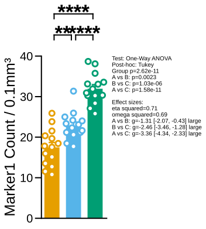

# plot_mean_bars

## Summary

`plot_mean_bars` draws one bar chart per selected summary column. Bars show
group means, optional points show individual observations, and statistical
comparisons can be annotated. Registry name: `mean_bars`.

Use it for first-pass group comparisons and publication-style summary plots.

## Example figure

<!-- gallery-example-code:start -->
Gallery render call (after `ex = build_example_data(fig_path=TMP)`, `exp = ex.experiment`, and `P = PyFLASH.plotting`):

```python
P.plot_mean_bars(exp, filtered_columns=["Marker1_Count"], save=True)
```
<!-- gallery-example-code:end -->



*`Marker1_Count` across groups A/B/C with individual points and pairwise tests. Rendered from the [synthetic example dataset](../examples/README.md).*

## Signature

```python
plot_mean_bars(
    experiment,
    filtered_columns=None,
    data_cols=None,
    points=True,
    normalize=False,
    point_fill=None,
    point_edge=None,
    point_size=None,
    point_linewidth=None,
    specificity=None,
    filter_by=None,
    roi=None,
    comparisons=None,
    force_nonparametric=False,
    ns="ns",
    posthoc="Conover",
    posthoc_correction="auto",
    multiple_comparison="One-Way",
    bottom_ticks=False,
    bottom_tick_labels=False,
    factor=None,
    split_by=None,
    save=True,
    column_strings=None,
    regex_string=None,
    exclude="",
    data_col_contains=None,
    data_col_regex=None,
    data_col_exclude=None,
    save_normality=True,
    normality_dpi=96,
    auto_style=None,
    style_cycle=None,
    legend=False,
    dry_run=False,
    conditions=None,
    condition_col="Condition",
    factor_cols=None,
    animal_col="AnimalName",
    group_list=None,
    groups=None,
    group_col=None,
    group_cols=None,
    subject_col=None,
    dataframe_kwargs=None,
)
```

## Input Object Types

| Object type | Accepted? | Notes |
|---|---:|---|
| `Batch` | Yes | Main supported input. Uses `summary`, `condition_list`, and `fig_path`. |
| `Experiment` | Yes | Works when it exposes the same summary and condition attributes. |
| `MiniExperiment` | Usually | Works for summary-style data when required columns exist. |
| `pandas.DataFrame` | Yes | Provide `group_col=...` or `group_cols=...`; the function wraps it with `from_dataframe` internally. |

## Parameters

| Parameter | Type | Default | Meaning |
|---|---|---:|---|
| `experiment` | `Batch`, `Experiment`, or `MiniExperiment` | required | Data source to plot. |
| `data_cols` | list-like or `None` | `None` | Exact data columns to plot. Alias: `filtered_columns`. |
| `data_col_contains` | list-like, `str`, or `None` | `None` | Include columns whose names contain these strings. Alias: `column_strings`. |
| `data_col_regex` | `str` or list-like | `None` | Include columns matching one or more regular expressions. Alias: `regex_string`. |
| `data_col_exclude` | `str` or list-like | `None` | Exclude columns whose names contain these strings. Alias: `exclude`, whose legacy default is `""`. |
| `points` | `bool` | `True` | Overlay individual observations on bars. |
| `normalize` | `bool` | `False` | Normalize values before plotting. |
| `filter_by` | dict, tuple, list, or `None` | `None` | Row filter such as `{"Time": "WeekEight"}`. Alias: `specificity`. |
| `roi` | `str`, list-like, or `None` | `None` | ROI-base selector. Multiple ROI bases run queue mode. |
| `comparisons` | list-like or `None` | `None` | Comparison pairs. `None` uses planned comparisons from the group list when available. |
| `force_nonparametric` | `bool` | `False` | Forces the multi-group path toward non-parametric testing. The current two-group path still uses the t-test branch when both groups have enough observations. |
| `posthoc` | `str` | `"Conover"` | Post-hoc test for multi-group comparisons. ANOVA accepts Tukey, Dunnett, Fisher LSD, Bonferroni, Sidak, Holm-Sidak, Scheffe, and Tamhane T2. Kruskal-Wallis accepts Conover, Dunn, Nemenyi, and DSCF. |
| `posthoc_correction` | `str` | `"auto"` | Multiple-testing correction for Dunn/Conover and Fisher LSD paths. |
| `multiple_comparison` | `str` | `"One-Way"` | Overall comparison mode. |
| `split_by` | `str` or `None` | `None` | Group by a specific group column instead of full groups. Alias: `factor`. |
| `save` | `bool` | `True` | Save figures under `experiment.fig_path`. |
| `save_normality` | `bool` | `True` | Save normality check outputs when applicable. |
| `auto_style` | `bool` or `None` | `None` | Automatically vary bar styles when groups share colors. `None` uses the active PyFLASH style default. |
| `point_fill`, `point_edge`, `point_size`, `point_linewidth` | style value or `None` | `None` | Point overlay style overrides. `None` uses the active PyFLASH style defaults. |
| `legend` | `bool` | `False` | Add a legend. |
| `dry_run` | `bool` | `False` | Compute a statistics table but skip figure creation and saving. Its two-group test selection is not identical to the normal plotting annotation path when `force_nonparametric=True`. |
| `conditions` | `groupList` or `None` | `None` | Optional group metadata when passing a raw DataFrame. Aliases: `group_list`, `groups`. |
| `condition_col` | `str` | `"Condition"` | Group column used when passing a raw DataFrame. Alias: `group_col`. |
| `factor_cols` | list-like or `None` | `None` | Group columns used to infer crossed groups from a raw DataFrame. Alias: `group_cols`. |
| `animal_col` | `str` | `"AnimalName"` | Subject/sample/animal ID column used when passing a raw DataFrame. Alias: `subject_col`. |
| `dataframe_kwargs` | `dict` or `None` | `None` | Advanced `from_dataframe` options such as colors, labels, ordering, and output paths. |

## Parameter Options

`posthoc`, `posthoc_correction`, `multiple_comparison`,
`force_nonparametric`, and `ns` use the shared statistics option vocabulary.
See [Statistics options](../parameters/statistics-options.md) for accepted
values and behavior.

## Returns

| Return value | Type | Meaning |
|---|---|---|
| result | `dict[str, list]` | Normal plotting mode returns the shared runner output, commonly including lists for `condition`, `mean`, and `n`. |
| result | `dict` | Queue mode returns a dictionary keyed by filter or ROI value. |
| stats | `pandas.DataFrame` | With `dry_run=True`, returns computed statistics without creating figures. In the dry-run path, `force_nonparametric=True` makes two-group rows use the Mann-Whitney U label, while normal plot annotations still use the t-test branch when both groups have enough observations. |

## Saved Outputs

When `save=True`, the function saves one figure per selected column under the
input object's figure folder. It uses PyFLASH's standard plot subfolder naming,
with factor and row-filter context encoded into filename suffixes. When several
ROI bases are queued, the ROI base is prepended as a top-level folder.

When `save_normality=True`, normality-check outputs may also be saved.

When `save=True` and interactive HTML export is enabled in configuration, an
optional `interactive_bars.html` can also be written in the bars output folder.

## Examples

### Plot explicit columns

```python
from PyFLASH.plotting import plot_mean_bars

plot_mean_bars(
    batch,
    data_cols=["GFAP Volume", "Iba1 Count"],
    save=True,
)
```

### Discover columns by text

```python
plot_mean_bars(
    batch,
    data_col_contains=["Volume", "Count"],
    data_col_exclude="NonColoc",
    save=True,
)
```

### Plot a raw DataFrame directly

```python
plot_mean_bars(
    df,
    data_cols=["GFAP Volume"],
    group_col="Diagnosis",
    subject_col="Subject ID",
    save=False,
)
```

### Group by one factor in a crossed design

```python
plot_mean_bars(
    batch,
    data_col_contains="GFAP",
    split_by="Diagnosis",
    comparisons=[("Control", "AD")],
)
```

### Compute statistics without writing figures

```python
stats = plot_mean_bars(
    batch,
    data_col_contains="GFAP",
    dry_run=True,
    save=False,
)

print(stats.head())
```

## Notes

- Prefer `data_cols` when you know the exact columns. Use
  `data_col_contains`, `data_col_regex`, and `data_col_exclude` for exploratory
  selection.
- `filter_by` filters rows before plotting. For example, `{"Time":
  "WeekEight"}` limits the plot to rows where the `Time` column is `WeekEight`.
- `auto_style=None` uses the active style default. Automatic styling is useful
  for crossed designs where groups may share a color but need distinct fills or
  hatches.
- `dry_run=True` is useful for checking tests and p-values before spending time
  rendering figures. Treat it as a dry-run summary table; for two groups with
  `force_nonparametric=True`, its test label can differ from the normal
  annotation path.

## See Also

- [Mean bars](../plot-types/mean-bars.md)
- [Column selection](../parameters/column-selection.md)
- [Groups and factors](../parameters/conditions-and-factors.md)
- [Saving](../parameters/saving.md)
- [Normality outputs](../outputs/normality-outputs.md)
- [Group comparisons](../statistics/group-comparisons.md)
- [`plot_group_matrix`](plot_group_matrix.md)
- [`plot_effect_forest`](plot_effect_forest.md)
- [`group_comparison`](group_comparison.md)
