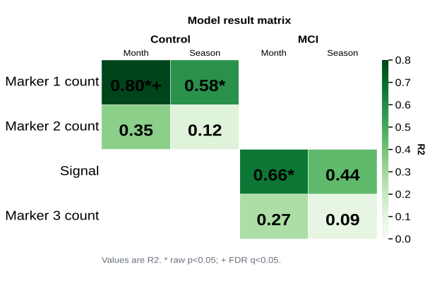

# plot_model_result_matrix

## Summary

`plot_model_result_matrix` draws one heatmap from a precomputed long-form model
results table. Each row in the source table is one matrix cell, such as one
outcome by one diagnosis group by one predictor profile.

It is registered as `model_result_matrix`.

Use it when model fitting has already happened and you want a publication-ready
matrix of values such as model R2, adjusted R2, p-values, q-values, or another
numeric score, with optional raw/FDR significance markers in each cell.

## Example figure

<!-- gallery-example-code:start -->
Gallery render call (after `ex = build_example_data(fig_path=TMP)`, `exp = ex.experiment`, and `P = PyFLASH.plotting`):

```python
import pandas as pd

model_results = pd.DataFrame(
    [
        {"outcome": "Signal", "label": "Signal", "group": "A", "profile": "x1 + x2", "r2": 0.82, "p": 0.001, "q": 0.006},
        {"outcome": "Signal", "label": "Signal", "group": "B", "profile": "x1 + x2", "r2": 0.61, "p": 0.012, "q": 0.036},
        {"outcome": "Signal", "label": "Signal", "group": "C", "profile": "x1 + x2", "r2": 0.44, "p": 0.080, "q": 0.160},
        {"outcome": "Marker1_Count", "label": "Marker1 Count", "group": "A", "profile": "x1 + x2", "r2": 0.18, "p": 0.330, "q": 0.500},
        {"outcome": "Marker1_Count", "label": "Marker1 Count", "group": "B", "profile": "x1 + x2", "r2": 0.24, "p": 0.220, "q": 0.410},
        {"outcome": "Marker1_Count", "label": "Marker1 Count", "group": "C", "profile": "x1 + x2", "r2": 0.39, "p": 0.041, "q": 0.090},
    ]
)
P.plot_model_result_matrix(
    exp,
    model_table=model_results,
    row_label_col="label",
    group_col="group",
    profile_col="profile",
    value_col="r2",
    title="Model result matrix",
    palette="Greens",
    save=True,
)
```
<!-- gallery-example-code:end -->



*Precomputed model R2 values by outcome and group. Rendered from a synthetic
long-form results table.*

## Signature

```python
plot_model_result_matrix(experiment=None, model_table=None, path=None, table_attr=None, row_col='outcome', row_label_col=None, group_col=None, profile_col='predictor', value_col='r2', p_col='p', q_col='q', filtered_columns=None, data_cols=None, column_strings=None, regex_string=None, exclude='', data_col_contains=None, data_col_regex=None, data_col_exclude=None, row_order=None, group_order=None, profile_order=None, group_labels=None, profile_labels=None, column_labels=None, value_label=None, value_format='.2f', p_alpha=0.05, q_alpha=0.05, significance_markers=None, title='Model result matrix', model_note='auto', footer='auto', specificity=None, filter_by=None, roi=None, save=True, filename='Model Result Matrix', subfolder='Model Results', figsize=None, tick_label_size=20, cmap=None, palette=None, vmin=None, vmax=None, return_data=True)
```

## Input Object Types

| Object type | Accepted? | Notes |
|---|---:|---|
| `Batch` | Yes | Reads a model-results table from `.summary` by default, or from a named `.summaries` entry, `.data` table, or attribute. |
| `Experiment` | Yes | Same table-resolution behavior as `Batch`. |
| `MiniExperiment` | Yes | Works when its `.summary` or a named table contains model-result rows. |
| `DataFrameExperiment` | Yes | Works with `.summary`, `.summaries`, `.data`, or a named attribute such as `model_results`. |
| `pandas.DataFrame` | Yes | Treated directly as the long-form model-results table. |
| CSV path | Yes | Pass as `path=...`, as `model_table=...`, or as the first argument. |
| table-like object | Yes | Anything coercible to `pandas.DataFrame` is accepted. |

## Parameters

| Parameter | Type | Default | Meaning |
|---|---|---|---|
| `experiment` | PyFLASH object, `DataFrame`, path, or `None` | `None` | Source object or table. |
| `model_table` | `DataFrame`, path, table-like, or string | `None` | Explicit table source. A string can name an attribute/table on `experiment`. |
| `path` | path-like or `None` | `None` | CSV file containing model-result rows. |
| `table_attr` | string or `None` | `None` | Attribute/table name to read from a PyFLASH object. |
| `row_col` | string | `'outcome'` | Column containing the outcome or metric key. |
| `row_label_col` | string or `None` | inferred | Display label for each row. |
| `group_col` | string, `None`, or `False` | inferred | Optional group column. Use `False` to force no group split. |
| `profile_col` | string | `'predictor'` | Column containing model profile or predictor-set labels. |
| `value_col` | string | `'r2'` | Numeric value used for cell colour and displayed text. |
| `p_col`, `q_col` | string or `None` | `'p'`, `'q'` | Raw p-value and FDR q-value columns for markers. Missing columns are ignored. |
| `data_cols` | list-like or `None` | `None` | Row keys or row labels to keep. Alias: `filtered_columns`. |
| `row_order`, `group_order`, `profile_order` | list-like or `None` | `None` | Explicit display ordering. Unmatched values remain after requested values. |
| `group_labels`, `profile_labels`, `column_labels` | mapping or `None` | `None` | Display-label mappings. `column_labels` is an alias for `profile_labels`. |
| `value_format` | string or callable | `'.2f'` | In-cell numeric format. |
| `cmap`, `palette` | colormap or string | inferred | Heatmap colours. `palette` accepts seaborn names such as `"Greens"`; R2-like values default to a green sequential map. |
| `vmin`, `vmax` | float or `None` | inferred | Manual colorbar limits. R2-like values default to `0` through the observed maximum rounded up to the nearest `0.1`. |
| `p_alpha`, `q_alpha` | float | `0.05` | Thresholds for raw p and FDR q markers. |
| `significance_markers` | mapping or `None` | `None` | Marker mapping, e.g. `{"p": "*", "q": "+"}`. |
| `model_note` | string, `'auto'`, or falsey | `'auto'` | Grey explanatory text below the matrix. The automatic text describes the displayed `y ~ profile` model. |
| `filter_by` | mapping, tuple, list, or `None` | `None` | Row filter or filter queue. Alias: `specificity`. |
| `roi` | string, list, or `None` | `None` | Select a named `.summaries` table, filter an ROI/Region column, or run a queue. |
| `save` | bool | `True` | Write an SVG with editable text. |
| `return_data` | bool | `True` | Return matrices, source table, records, and saved path. |

## Returns

With `return_data=True`, the function returns a dictionary:

| Key | Type | Meaning |
|---|---|---|
| `path` | string or `None` | Saved SVG path when `save=True`. |
| `table` | `pandas.DataFrame` | Filtered source table used for plotting. |
| `values` | `pandas.DataFrame` | Numeric matrix used for heatmap colours. |
| `annotations` | `pandas.DataFrame` | Editable in-cell text, including significance markers. |
| `p_values`, `q_values` | `pandas.DataFrame` or `None` | Raw/FDR significance matrices when those columns exist. |
| `records` | list of dict | One record per resolved matrix cell. |
| `vmin`, `vmax` | float or `None` | Colorbar limits used for the render. |
| `figure` | Matplotlib `Figure` | Included only when `save=False`. |

With `return_data=False`, the function returns the saved path when `save=True`
or the Matplotlib figure when `save=False`.

## Saved Outputs

With `save=True`, output is written below the PyFLASH object's `fig_path`, or
beside the CSV path when no object is provided:

```text
Model Results/Model Result Matrix.svg
```

`filter_by` and `roi` add the usual PyFLASH suffix/subfolder tags.

## Examples

CSV input:

```python
from PyFLASH.plotting import plot_model_result_matrix

out = plot_model_result_matrix(
    path="seasonal_model_results.csv",
    row_col="outcome",
    row_label_col="label",
    group_col="Diagnosis",
    profile_col="predictor",
    value_col="r2",
)
```

Named table on a PyFLASH object:

```python
batch.model_results = model_results

out = plot_model_result_matrix(
    batch,
    model_table="model_results",
    data_cols=["Amplitude", "Period"],
    group_order=["Control", "MCI", "AD"],
    profile_order=["Month", "Season"],
    palette="Greens",
)
```

ROI-specific result table:

```python
out = plot_model_result_matrix(
    batch,
    roi="SCN",
    value_col="q",
    value_label="FDR q",
)
```

## Notes

The function does not fit models. Use
[`plot_multivariable_regression_matrix`](plot_multivariable_regression_matrix.md),
[`linear_model`](linear_model.md), or another modelling pipeline when you need
PyFLASH to compute the statistics from subject-level rows.

This registry entry is describe-layer `covered`: when `PyFLASH.report` is
active, each plotted cell emits a structured `model_result_matrix` record.

The default grey model note explains the model shape, for example
`Model in each cell: y ~ Month/Season within Diagnosis.`

## See Also

- [Model Summary Plots](../plot-types/model-summary-plots.md)
- [Regression Plots](../plot-types/regression-plots.md)
- [`plot_multivariable_regression_matrix`](plot_multivariable_regression_matrix.md)
- [Structured results](../statistics/structured-results.md)
