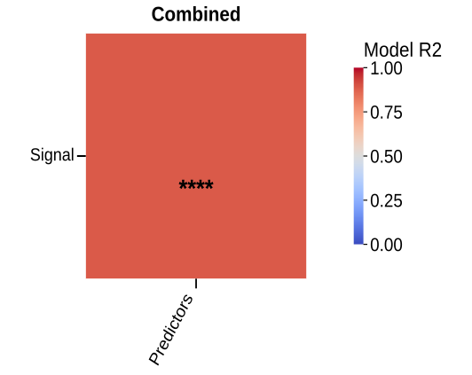

# plot_multivariable_regression_matrix

## Summary

`plot_multivariable_regression_matrix` draws heatmaps where each cell is a
joint regression model, such as `outcome ~ predictor_1 + predictor_2`. It is
registered as `multivariable_regression_matrix`.

Use it to compare many outcomes against named predictor sets while keeping the
model results inspectable from Python.

## Example figure

<!-- gallery-example-code:start -->
Gallery render call (after `ex = build_example_data(fig_path=TMP)`, `exp = ex.experiment`, and `P = PyFLASH.plotting`):

```python
P.plot_multivariable_regression_matrix(
    exp,
    filtered_columns=["Signal"],
    predictors={"Predictors": ["x1", "x2"]},
    by="all",
    save=True,
)
```
<!-- gallery-example-code:end -->



*Joint regression of `Signal` on predictors `x1`+`x2` (model R²). Rendered from the [synthetic example dataset](../examples/README.md).*

## Signature

```python
plot_multivariable_regression_matrix(experiment, filtered_columns=None, data_cols=None, predictors=None, by='conditions', factor=None, specificity=None, split_by=None, filter_by=None, roi=None, save=True, column_strings=None, regex_string=None, exclude='', data_col_contains=None, data_col_regex=None, data_col_exclude=None, min_n=None, value='r2', correction='fdr', alpha=0.05, tick_label_size=20, conditions=None, condition_col='Condition', factor_cols=None, animal_col='AnimalName', group_list=None, groups=None, group_col=None, group_cols=None, subject_col=None, dataframe_kwargs=None, combine_conditions=True, column_order=None, predictor_order=None, share_columns_across_panels=True, blank_panel_on_nan=False)
```

## Input Object Types

| Object type | Accepted? | Notes |
|---|---:|---|
| `Batch` | Yes | Main supported input. |
| `Experiment` | Yes | Works with `.summary`, `.condition_list`, and figure paths. |
| `MiniExperiment` | Yes | Works for summary-style data. |
| `pandas.DataFrame` | Yes | Wrapped internally; pass `group_col` and `subject_col` when needed. |

## Parameters

| Parameter | Type | Default | Meaning |
|---|---|---|---|
| `experiment` | `Batch`, experiment-like object, or `DataFrame` | required | Data source containing a summary table. |
| `data_cols` | list-like or `None` | `None` | Outcome columns. If discovered broadly, predictor columns are removed from the outcome list. Alias: `filtered_columns`. |
| `predictors` | mapping or iterable | required | Predictor-set definitions, usually `{"label": ["col1", "col2"]}`. |
| `split_by` | string | `'conditions'` | Panel by conditions, by `"all"`, or by a factor. Alias: `by`. |
| `factor` | string or `None` | `None` | Explicit factor column for panels. |
| `filter_by` | mapping, tuple, list, or `None` | `None` | Row filter or filter queue. Alias: `specificity`. |
| `roi` | string, list, or `None` | `None` | Select one ROI summary or run an ROI queue. |
| `min_n` | int or `None` | `None` | Minimum complete rows per model. The effective minimum is at least `number_of_predictors + 2`. |
| `value` | string | `'r2'` | Heatmap value. |
| `correction` | string | `'fdr'` | Star annotation basis: `'fdr'` for q-values or `'none'`/`'p'` for raw p-values. |
| `alpha` | float | `0.05` | Threshold for star annotations. |
| `column_order`, `predictor_order` | list-like or `None` | `None` | Reorder outcome rows or predictor-set columns. |
| `share_columns_across_panels` | bool | `True` | Keep only outcome/predictor combinations valid in every panel. |
| `blank_panel_on_nan` | bool | `False` | Keep invalid cells as NaN instead of dropping empty axes. |
| `save` | bool | `True` | Write one combined SVG figure. |

## Parameter Options

### `value` options

| Option | Behavior |
|---|---|
| `'r2'` (default) | Plot model R-squared. |
| `'adj_r2'` | Plot adjusted R-squared. |
| `'p'` | Plot raw model p-values. |
| `'q'` | Plot corrected q-values. |

### `correction` options

| Option | Behavior |
|---|---|
| `'fdr'` (default) | Use q-values for star annotations. |
| `'p'` | Use raw p-values for star annotations. |
| `'none'` | Do not use corrected q-values for star annotations. |

## Returns

| Return value | Type | Meaning |
|---|---|---|
| `outputs` | `dict` | One entry per condition, factor level, or `"Combined"` panel. |
| `outputs[panel]["models"]` | `dict` | Model payloads keyed like `"Signal ~ PairA"`. |
| `outputs[panel]["values"]` | `pandas.DataFrame` | Heatmap values for the selected `value`. |
| `outputs[panel]["p_values"]` | `pandas.DataFrame` | Raw model p-values. |
| `outputs[panel]["q_values"]` | `pandas.DataFrame` | Benjamini-Hochberg q-values across the panel's tested cells. |
| `outputs[panel]["dropped_y"]`, `outputs[panel]["dropped_predictors"]` | `list` | Axes dropped because no valid model remained. |

Each model payload includes keys such as `n`, `r2`, `adj_r2`, `f`, `p`, `q`,
`df_model`, `df_resid`, `coefficients`, `rank`, `rank_deficient`,
`predictor_set`, and `predictors`.

## Saved Outputs

With `save=True`, PyFLASH writes one SVG figure below the input object's figure
folder, usually in:

```text
Multivariable Regression/Matrices/
```

The filename begins with `Multivariable Regression Matrix` and includes the
panel names plus any filter, factor, or ROI suffix. The standalone plot does
not write model CSVs; use the returned `outputs` dictionary for model tables.

## Examples

Minimal model matrix:

```python
from PyFLASH.plotting import plot_multivariable_regression_matrix

out = plot_multivariable_regression_matrix(
    batch,
    data_cols=["GFAP_Count", "Iba1_Count"],
    predictors={"Age model": ["Age", "AgeSquared"]},
    split_by="all",
    save=False,
)
```

Raw DataFrame with two predictor sets:

```python
out = plot_multivariable_regression_matrix(
    df,
    data_cols=["Signal", "Noise"],
    predictors={"PairA": ["x1", "x2"], "PairB": ["z1", "z2"]},
    group_col="Diagnosis",
    subject_col="AnimalName",
    split_by="all",
    value="q",
    save=False,
)
```

Inspect a model:

```python
model = out["Combined"]["models"]["Signal ~ PairA"]
print(model["r2"], model["q"], model["coefficients"])
```

## Notes

Predictor sets are validated against the active summary table. Missing
predictor names raise a `ValueError`, and duplicate predictor-set labels are not
allowed.

The model is an ordinary least-squares fit using a numeric design matrix with an
intercept. Non-numeric, excluded, and missing rows are dropped per model.
Rank-deficient designs are reported through `rank_deficient` rather than hidden.

This registry entry is describe-layer `covered`: when `PyFLASH.report` is
active, each valid model emits a structured multivariable regression record.

## See Also

- [Regression Plots](../plot-types/regression-plots.md)
- [`plot_regressions`](plot_regressions.md)
- [Column selection](../parameters/column-selection.md)
- [Model options](../parameters/model-options.md)
- [Linear models](../statistics/linear-models.md)
- [Structured results](../statistics/structured-results.md)
