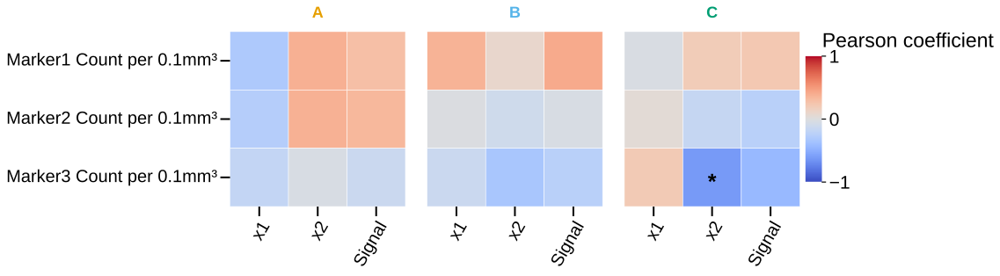

# plot_rect_matrices

## Summary

`plot_rect_matrices` draws rectangular correlation heatmaps where one set of
columns is placed on the Y axis and a second set is placed on the X axis. It is
registered as `rect_matrices`.

Use it when the two sides of the question differ, such as marker columns
against behavior, age, batch metrics, or covariates.

## Example figure

<!-- gallery-example-code:start -->
Gallery render call (after `ex = build_example_data(fig_path=TMP)`, `exp = ex.experiment`, and `P = PyFLASH.plotting`):

```python
P.plot_rect_matrices(
    exp,
    filtered_columns=["Marker1_Count", "Marker2_Count", "Marker3_Count"],
    against_columns=["x1", "x2", "Signal"],
    save=True,
)
```
<!-- gallery-example-code:end -->



*Rectangular correlation heatmap: marker counts (rows) vs `x1`/`x2`/`Signal` (columns). Rendered from the [synthetic example dataset](../examples/README.md).*

## Signature

```python
plot_rect_matrices(experiment, filtered_columns=None, data_cols=None, against_columns=None, against_data_cols=None, by='conditions', factor=None, specificity=None, split_by=None, filter_by=None, roi=None, save=True, correlation='pearsonr', tick_label_size=20, column_strings=None, regex_string=None, exclude='', data_col_contains=None, data_col_regex=None, data_col_exclude=None, against_column_strings=None, against_regex_string=None, against_exclude='', against_data_col_contains=None, against_data_col_regex=None, against_data_col_exclude=None, conditions=None, condition_col='Condition', factor_cols=None, animal_col='AnimalName', group_list=None, groups=None, group_col=None, group_cols=None, subject_col=None, dataframe_kwargs=None, encode_x_categorical=True, combine_conditions=True, column_order=None, against_order=None, share_columns_across_panels=True, blank_panel_on_nan=False, triangle=None, show_diagonal=True, show_values=False, value_format='.2f', cmap=None, palette=None)
```

## Input Object Types

| Object type | Accepted? | Notes |
|---|---:|---|
| `Batch` | Yes | Main supported input. |
| `Experiment` | Yes | Works with `.summary`, `.condition_list`, and figure paths. |
| `MiniExperiment` | Yes | Works for summary-style data. |
| `pandas.DataFrame` | Yes | Wrapped internally; pass `group_col` and `subject_col` when needed. |

## Parameters

| Parameter | Type | Default | Meaning |
|---|---|---|---|
| `experiment` | `Batch`, experiment-like object, or `DataFrame` | required | Data source containing a summary table. |
| `data_cols` | list-like or `None` | `None` | Y-axis columns. Alias: `filtered_columns`. |
| `against_data_cols` | list-like or `None` | `None` | X-axis columns. Alias: `against_columns`. |
| `data_col_contains`, `data_col_regex`, `data_col_exclude` | string/list filters | `None`, `None`, `None` | Discover Y-axis columns. Aliases: `column_strings`, `regex_string`, `exclude`. |
| `against_data_col_contains`, `against_data_col_regex`, `against_data_col_exclude` | string/list filters | `None`, `None`, `None` | Discover X-axis columns. Aliases: `against_column_strings`, `against_regex_string`, `against_exclude`. |
| `split_by` | string | `'conditions'` | Panel by conditions, by `"all"`, or by a factor. Alias: `by`. |
| `factor` | string or `None` | `None` | Explicit factor column for panels. |
| `correlation` | string | `'pearsonr'` | Pearson, Spearman, Kendall, or aliases `p`, `s`, `k`. |
| `encode_x_categorical` | bool | `True` | Encode non-numeric X columns when possible so categorical covariates can be correlated. |
| `column_order`, `against_order` | list-like or `None` | `None` | Apply requested order to Y and X axes. |
| `share_columns_across_panels` | bool | `True` | Keep a shared valid Y/X set across panels. |
| `blank_panel_on_nan` | bool | `False` | Keep requested axes and mark invalid cells as `NaN` instead of dropping axes. |
| `triangle`, `show_diagonal`, `show_values`, `value_format` | display options | `None`, `True`, `False`, `'.2f'` | Compact matrix rendering controls. |
| `cmap`, `palette` | colormap or string | inferred | Heatmap colours. `palette` accepts seaborn names and maps to the shared matrix colormap helper. |
| `filter_by` | mapping, tuple, list, or `None` | `None` | Row filter or filter queue. Alias: `specificity`. |
| `roi` | string, list, or `None` | `None` | Select one ROI summary or run an ROI queue. |
| `save` | bool | `True` | Write the combined heatmap figure to disk. |

## Returns

| Return value | Type | Meaning |
|---|---|---|
| `outputs` | `dict` | One entry per condition, factor level, or `"Combined"` panel. |
| `outputs[panel]["correlations"]` | `dict` | Pair labels such as `"GFAP_Count vs Age"` mapped to `(p_value, coefficient)`. |
| `outputs[panel]["dropped_y"]` | `list` | Y columns dropped for that panel or globally. |
| `outputs[panel]["dropped_x"]` | `list` | X columns dropped for that panel or globally. |

## Saved Outputs

With `save=True`, PyFLASH writes one SVG figure below the input object's figure
folder, usually in `Rectangular/Matrices/`. The filename starts with
`Rectangular <method> Correlation Matrix` and includes panel names plus any
filter, factor, or ROI suffix.

No CSV table is written by this standalone plot. Use the returned dictionary or
the correlation pipelines when you need saved matrices.

## Examples

Minimal rectangular heatmap:

```python
from PyFLASH.plotting import plot_rect_matrices

rect = plot_rect_matrices(
    batch,
    data_cols=["GFAP_Count", "Iba1_Count"],
    against_data_cols=["Age"],
    split_by="all",
    save=False,
)
```

Keep requested cells visible and label values:

```python
rect = plot_rect_matrices(
    batch,
    data_col_contains=["_Count"],
    against_data_cols=["Age", "BehaviourScore"],
    split_by="Diagnosis",
    blank_panel_on_nan=True,
    show_values=True,
    value_format=".3f",
    save=False,
)
```

Inspect dropped columns and one result:

```python
panel = rect["Combined"]
print(panel["dropped_y"], panel["dropped_x"])
print(panel["correlations"]["GFAP_Count vs Age"])
```

## Notes

The function computes each Y/X cell after dropping incomplete rows for that
pair. A cell needs more than one complete pair to receive a coefficient and
p-value.

`blank_panel_on_nan=True` is useful for publication layouts where every panel
must keep the same requested row and column labels, even if some cells are not
estimable.

The registry entry is describe-layer `unreviewed`. It returns numeric
correlation values, but it does not yet emit structured report records.

## See Also

- [Matrix Plots](../plot-types/matrix-plots.md)
- [`plot_matrices`](plot_matrices.md)
- [`plot_matrix_differences`](plot_matrix_differences.md)
- [Column selection](../parameters/column-selection.md)
- [Correlation statistics](../statistics/correlation.md)
