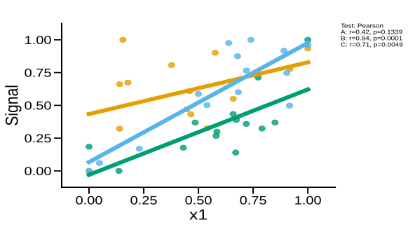

# plot_regressions

## Summary

`plot_regressions` draws scatter plots with fitted regression lines for one
`x` column against one `y` column. It is registered as `regressions`.

Use it to inspect the data behind a selected relationship, either as one plot
per group or as a combined overlay.

## Example figure

<!-- gallery-example-code:start -->
Gallery render call (after `ex = build_example_data(fig_path=TMP)`, `exp = ex.experiment`, and `P = PyFLASH.plotting`):

```python
P.plot_regressions(exp, x="x1", y="Signal", combine=True, save=True)
```
<!-- gallery-example-code:end -->



*`x1` vs `Signal` regression with the three groups overlaid. Rendered from the [synthetic example dataset](../examples/README.md).*

## Signature

```python
plot_regressions(experiment, x, y, by='conditions', factor=None, test='pearsonr', normalize_x=True, normalize_y=True, specificity=None, filter_by=None, roi=None, save=True, combine=False, split_by=None, x_range=None, y_range=None, xmin=None, xmax=None, ymin=None, ymax=None, clip_fit_line=True, share_axes=True, margin=0.1, auto_style=None, style_cycle=None, point_size=None, point_alpha=None, point_edge=None, point_linewidth=None, line_width=None, conditions=None, condition_col='Condition', factor_cols=None, animal_col='AnimalName', group_list=None, groups=None, group_col=None, group_cols=None, subject_col=None, dataframe_kwargs=None)
```

## Input Object Types

| Object type | Accepted? | Notes |
|---|---:|---|
| `Batch` | Yes | Main supported input. |
| `Experiment` | Yes | Works with `.summary`, `.condition_list`, and figure paths. |
| `MiniExperiment` | Yes | Works for summary-style data. |
| `pandas.DataFrame` | Yes | Wrapped internally; pass `group_col` and `subject_col` when needed. |

## Parameters

| Parameter | Type | Default | Meaning |
|---|---|---|---|
| `experiment` | `Batch`, experiment-like object, or `DataFrame` | required | Data source containing a summary table. |
| `x`, `y` | string or sequence | required | Columns to plot. If either is a list, PyFLASH runs all requested combinations. |
| `split_by` | string | `'conditions'` | Plot by conditions, by `"all"`, or by a factor mode. Alias: `by`. |
| `factor` | string or `None` | `None` | Explicit factor column for grouping. |
| `test` | string | `'pearsonr'` | Correlation annotation method: Pearson, Spearman, Kendall, or aliases `p`, `s`, `k`. |
| `normalize_x`, `normalize_y` | bool, tuple, or string | `True`, `True` | `True` min-max normalizes to 0-1; `False` keeps native units; `(min, max)` maps to a range; `"Z-score"` standardizes. |
| `combine` | bool | `False` | Overlay groups on one plot instead of making separate figures. |
| `x_range`, `y_range`, `xmin`, `xmax`, `ymin`, `ymax` | numeric bounds | `None` | Manual axis limits. Range tuples and individual bounds are merged. |
| `share_axes` | bool | `True` | Share axis limits across queued sibling plots when a column repeats. |
| `margin` | float | `0.1` | Add breathing room around points unless the relevant bound is pinned. Use `0` to disable. |
| `clip_fit_line` | bool | `True` | Trim the fitted line to the active axis limits. |
| `filter_by` | mapping, tuple, list, or `None` | `None` | Row filter or filter queue. Alias: `specificity`. |
| `roi` | string, list, or `None` | `None` | Select one ROI summary or run an ROI queue. |
| `auto_style`, `style_cycle` | bool or `None`, list | `None`, `None` | Use condition styles to distinguish same-color crossed groups. `None` uses the active PyFLASH style default. |
| `point_size`, `point_alpha`, `point_edge`, `point_linewidth` | style value or `None` | `None` | Point overlay style overrides. `None` uses the active PyFLASH style defaults. |
| `line_width` | number or `None` | `None` | Regression line width override. `None` uses the active PyFLASH style default. |
| `save` | bool | `True` | Write SVG figures to disk. |

## Returns

| Return value | Type | Meaning |
|---|---|---|
| `result` | `dict` | Plot-run accumulator with list-valued fields. Ordinary calls include `regression`, `r`, `p`, and `group` lists. Queue modes may wrap this accumulator in outer column, ROI, or filter contexts. |
| `result["regression"]` | `list` | Return from `seaborn.regplot` for each rendered group, typically the Matplotlib axes-style plotting object, or `None` for empty groups. |
| `result["r"]` | `list[float]` | Correlation coefficient for each rendered group. |
| `result["p"]` | `list[float]` | P-value for each rendered group. |
| `result["group"]` | `list[str]` | Group labels in the same order as the other lists. |

When `combine=True`, the same axes receives multiple group fits and the
teardown writes or closes the combined figure after the final group.

## Saved Outputs

With `save=True`, PyFLASH writes SVG files below the input object's figure
folder in `Regressions/`. Separate figures are named like:

```text
<x> vs <y> (<group>) <method>.svg
```

Combined figures are named like:

```text
<x> vs <y> (Combined) <method>.svg
```

Filter, factor, and ROI suffixes are included when those options are active.

## Examples

Minimal preview:

```python
from PyFLASH.plotting import plot_regressions

fits = plot_regressions(
    batch,
    x="Age",
    y="GFAP_Count",
    normalize_x=False,
    normalize_y=False,
    save=False,
)
```

Combined overlay by diagnosis:

```python
fits = plot_regressions(
    df,
    x="Age",
    y="Iba1_Count",
    group_col="Diagnosis",
    subject_col="AnimalName",
    split_by="Diagnosis",
    combine=True,
    test="spearman",
    save=False,
)
```

Queue several Y columns and inspect results:

```python
queued = plot_regressions(
    batch,
    x="Age",
    y=["GFAP_Count", "Iba1_Count"],
    normalize_x=False,
    normalize_y=False,
    save=False,
)

for (x_col, y_col), result in queued.items():
    print(x_col, y_col, result)
```

## Notes

The function coerces both plotted columns to numeric values and drops incomplete
pairs before fitting. If a group has fewer than two complete pairs, it draws no
fit line and returns `r=nan`, `p=nan` for that group.

The plotted p-value annotation is from the selected correlation method, not a
full linear-model pipeline. For adjusted models, use [`linear_model`](linear_model.md)
or [`plot_multivariable_regression_matrix`](plot_multivariable_regression_matrix.md).

This registry entry is describe-layer `covered`: when `PyFLASH.report` is
active, each group fit emits a structured correlation record.

## See Also

- [Regression Plots](../plot-types/regression-plots.md)
- [Matrix Plots](../plot-types/matrix-plots.md)
- [Groups and factors](../parameters/conditions-and-factors.md)
- [Filter By and row filters](../parameters/specificity.md)
- [Correlation statistics](../statistics/correlation.md)
- [Structured results](../statistics/structured-results.md)
