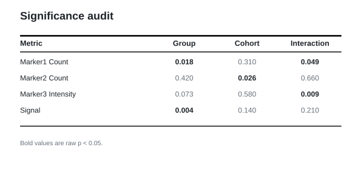

# plot_significance_audit_table

## Summary

`plot_significance_audit_table` renders a generic precomputed p-value audit as
either a baseline-style table or a compact matrix. Registry name:
`significance_audit_table`.

It does not assume any fixed control columns, model names, marker names, or
presentation paths. Use explicit column mappings for reproducible reports, or
allow data-shape-based p-value column inference for quick audits.

## Example figure

<!-- gallery-example-code:start -->
Gallery render call (after `ex = build_example_data(fig_path=TMP)`, `exp = ex.experiment`, and `P = PyFLASH.plotting`):

```python
import pandas as pd

audit = pd.DataFrame({
    "metric": [
        "Marker1 Count",
        "Marker2 Count",
        "Marker3 Intensity",
        "Signal",
    ],
    "p_group": [0.018, 0.42, 0.073, 0.004],
    "p_cohort": [0.31, 0.026, 0.58, 0.14],
    "p_interaction": [0.049, 0.66, 0.009, 0.21],
})
P.plot_significance_audit_table(
    exp,
    audit_table=audit,
    row_label_col="metric",
    pvalue_cols=["p_group", "p_cohort", "p_interaction"],
    column_labels={
        "p_group": "Group",
        "p_cohort": "Cohort",
        "p_interaction": "Interaction",
    },
    aesthetic="table",
    title="Significance audit",
    save=True,
)
```
<!-- gallery-example-code:end -->



*Generic p-value audit table with significant cells emphasized. Rendered from the [synthetic example dataset](../examples/README.md).*

## Signature

```python
plot_significance_audit_table(
    experiment=None,
    audit_table=None,
    path=None,
    row_label_col=None,
    pvalue_cols=None,
    id_cols=None,
    alpha=0.05,
    aesthetic="table",
    title="Significance audit",
    subtitle=None,
    column_labels=None,
    value_format="p",
    save=True,
    filename="Significance Audit",
    specificity=None,
    filter_by=None,
    figsize=None,
)
```

## Parameters

| Parameter | Meaning |
|---|---|
| `audit_table` | DataFrame or table-like object containing precomputed p-values. |
| `path` | CSV/Excel file path used when `audit_table` is not supplied. |
| `row_label_col` | Column to use as the row label. If omitted, PyFLASH chooses a likely text label column. |
| `pvalue_cols` | Exact p-value columns. If omitted, numeric columns in the 0-1 range are inferred. |
| `id_cols` | Optional non-p-value identifier columns kept out of p-value inference. |
| `alpha` | Threshold used for bold/significant cells. |
| `aesthetic` | `"table"`/`"baseline"` for the baseline-table look, or `"matrix"`/`"heatmap"` for the compact cell view. |
| `column_labels` | Optional display labels for p-value columns. |
| `value_format` | Cell text format, currently optimized for p-values. |
| `filter_by` / `specificity` | Optional row filter or queue of row filters. |
| `filename`, `figsize`, `save` | Saved filename, figure size, and save behavior. |

## Returns

With `save=True`, returns the saved SVG path. With `save=False`, returns the
Matplotlib figure. Specificity queue mode returns a dictionary keyed by filter.

## Example

```python
from PyFLASH.plotting import plot_significance_audit_table

plot_significance_audit_table(
    audit_table=audit_df,
    row_label_col="metric",
    pvalue_cols=["p_age", "p_sex", "p_treatment"],
    column_labels={
        "p_age": "Age",
        "p_sex": "Sex",
        "p_treatment": "Treatment",
    },
    aesthetic="table",
)
```

Matrix aesthetic:

```python
plot_significance_audit_table(
    path="significance_audit.csv",
    row_label_col="metric",
    aesthetic="matrix",
)
```

## Notes

This plot is describe-layer covered. When `PyFLASH.report` is active, each
resolved p-value cell is emitted as a structured significance-audit record.

## See Also

- [Table and categorical summary plots](../plot-types/table-and-categorical-summary-plots.md)
- [Multiple testing](../statistics/multiple-testing.md)
- [Figure folders](../outputs/figure-folders.md)
