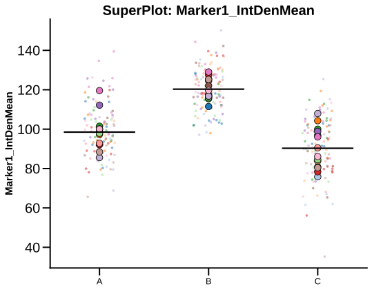

# plot_superplot

## Summary

`plot_superplot` draws ROI-level points, subject means, and group means for each
selected marker column. It is registered as `superplot` in
`PyFLASH.spec.PLOT_REGISTRY`.

Use it to show technical spread within subjects while keeping the subject as the
biological unit.

## Example figure

<!-- gallery-example-code:start -->
Gallery render call (after `ex = build_example_data(fig_path=TMP)`, `exp = ex.experiment`, and `P = PyFLASH.plotting`):

```python
P.plot_superplot(
    exp,
    filtered_columns=["Marker1_IntDenMean"],
    by="conditions",
    roi="ROIa",
    save=True,
)
```
<!-- gallery-example-code:end -->



*`Marker1_IntDenMean` per subject: ROI-level points plus subject means, across groups. Rendered from the [synthetic example dataset](../examples/README.md).*

## Signature

```python
plot_superplot(
    experiment,
    filtered_columns=None,
    data_cols=None,
    by="conditions",
    factor=None,
    specificity=None,
    split_by=None,
    filter_by=None,
    roi=None,
    column_strings=None,
    regex_string=None,
    exclude="",
    data_col_contains=None,
    data_col_regex=None,
    data_col_exclude=None,
    tick_label_size=20,
    save=True,
    condition_col="Condition",
    factor_cols=None,
    animal_col="AnimalName",
    group_list=None,
    groups=None,
    group_col=None,
    group_cols=None,
    subject_col=None,
    dataframe_kwargs=None,
)
```

## Input Object Types

| Object type | Accepted? | Notes |
|---|---:|---|
| `Batch` | Yes | Main supported input. Needs both summary columns and matching ROI-level marker data. |
| `Experiment` | Yes | Works when it exposes `summary`, `data`, `condition_list`, and figure paths. |
| `MiniExperiment` | Only if ROI data exist | A summary-only mini experiment will usually return no figures. |
| `pandas.DataFrame` | Conditionally | The adapter can wrap a raw table, but superplots need ROI-level `data`; a summary-only DataFrame has no ROI points to draw. |

## Parameters

| Parameter | Type | Default | Meaning |
|---|---|---:|---|
| `experiment` | `Batch`, `Experiment`, or adapter-compatible table | required | Data source. |
| `data_cols` | list-like or `None` | `None` | Exact data columns to analyze. Alias: `filtered_columns`. |
| `by` | `str` | `"conditions"` | Grouping mode. |
| `split_by` | `str` or `None` | `None` | Group by a factor column instead of the main condition groups. Alias: `factor`. |
| `filter_by` | dict, tuple, queue, or `None` | `None` | Row filter before grouping. Alias: `specificity`. |
| `roi` | `str`, list-like, or `None` | `None` | ROI-base selector. Multiple ROI bases return a queue dictionary. |
| `tick_label_size` | number | `20` | Base font size for labels and title. |
| `save` | `bool` | `True` | Save SVG figures under the input object's figure folder. |
| `group_col` | `str` or `None` | `None` | Grouping column for raw DataFrame input. Alias: `condition_col`. |
| `group_cols` | list-like or `None` | `None` | Crossed-group columns for raw DataFrame input. Alias: `factor_cols`. |
| `subject_col` | `str` or `None` | `None` | Subject/sample ID column. Alias: `animal_col`. |
| `group_list` | `groupList` or `None` | `None` | Optional group metadata for raw DataFrame input. Alias: `groups`. |
| `data_col_contains` | `str`, list-like, or `None` | `None` | Include data columns whose names contain these strings. Alias: `column_strings`. |
| `data_col_regex` | `str` or `None` | `None` | Include data columns matching this regex. Alias: `regex_string`. |
| `data_col_exclude` | `str`, list-like, or `None` | `None` | Exclude matching data columns after selection. Alias: `exclude`, whose legacy default is `""`. |
| `dataframe_kwargs` | `dict` or `None` | `None` | Advanced `from_dataframe` options. |

## Parameter Options

### `by` options

| Option | Behavior |
|---|---|
| `"conditions"` (default) | Use resolved condition/group panels. |
| `"all"` | Pool rows where supported. |

## Returns

| Return value | Type | Meaning |
|---|---|---|
| figures | `dict[str, matplotlib.figure.Figure]` | Dictionary keyed by selected summary column/marker. Columns without resolvable ROI data are skipped. |
| queued result | `dict` | When `roi` or `filter_by` is queued, returns nested dictionaries keyed by ROI base or filter. |

If no selected column can be resolved to ROI-level data, the function returns an
empty dictionary.

## Saved Outputs

When `save=True`, one SVG is written for each plotted column below
`experiment.fig_path`, normally in a `SuperPlot` subfolder.

Common filename:

```text
SuperPlot <column>.svg
```

Factor and row-filter contexts are encoded into filename suffixes. When several
ROI bases are queued, the ROI base is prepended as a top-level folder.

## Examples

### Plot one marker summary column

```python
from PyFLASH.plotting import plot_superplot

figures = plot_superplot(
    batch,
    data_cols=["GFAP_VolumeMean"],
    save=False,
)

print(figures.keys())
```

### Save superplots for several columns

```python
plot_superplot(
    batch,
    data_col_contains=["GFAP", "Iba1"],
    data_col_exclude="Raw",
    roi="SCN",
)
```

### Use factor grouping

```python
figures = plot_superplot(
    batch,
    data_cols=["GFAP_VolumeMean"],
    split_by="Diagnosis",
    save=False,
)
```

### Reuse returned figures

```python
figures = plot_superplot(batch, data_cols=["GFAP_VolumeMean"], save=False)

for column, fig in figures.items():
    fig.axes[0].set_title(f"{column} ROI spread")
```

## Notes

- SuperPlot lookup is best-effort. A selected summary column is matched to a
  marker table column or to a column with a common aggregation suffix removed.
- The plotted ROI points are technical observations. The larger animal mean
  points and the group mean line should carry the biological interpretation.
- `superplot` is describe-layer exempt. It is a descriptive standalone plot; the
  inferential capture path lives in [`group_comparison`](group_comparison.md).

## See Also

- [Group comparison plots](../plot-types/group-comparison-plots.md)
- [`plot_effect_forest`](plot_effect_forest.md)
- [`plot_group_matrix`](plot_group_matrix.md)
- [`group_comparison`](group_comparison.md)
- [Column selection](../parameters/column-selection.md)
- [Groups and factors](../parameters/conditions-and-factors.md)
- [Effect sizes](../statistics/effect-sizes.md)
