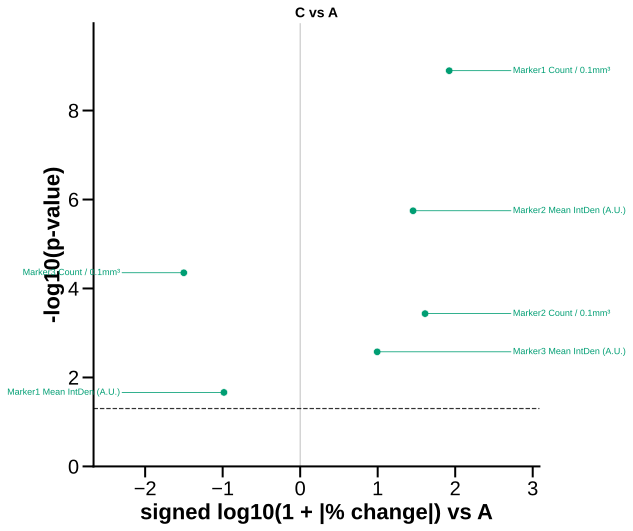

# plot_volcano

## Summary

`plot_volcano` draws group-vs-control screening plots across many numeric
columns. It is registered as `volcano`.

Each point is one selected column. The X axis is signed log-scaled percent
change versus the control group, and the Y axis is `-log10(p-value)`.

## Example figure

<!-- gallery-example-code:start -->
Gallery render call (after `ex = build_example_data(fig_path=TMP)`, `exp = ex.experiment`, and `P = PyFLASH.plotting`):

```python
P.plot_volcano(
    exp,
    filtered_columns=[
        "Marker1_Count",
        "Marker2_Count",
        "Marker3_Count",
        "Marker1_IntDenMean",
        "Marker2_IntDenMean",
        "Marker3_IntDenMean",
    ],
    control="A",
    save=True,
)
```
<!-- gallery-example-code:end -->



*Group C vs control A: signed % change vs −log10 p across markers. Rendered from the [synthetic example dataset](../examples/README.md).*

## Signature

```python
plot_volcano(experiment, filtered_columns=None, data_cols=None, by='conditions', factor=None, split_by=None, control=None, specificity=None, filter_by=None, roi=None, force_nonparametric=False, p_threshold=0.05, label_points='significant', save=True, column_strings=None, regex_string=None, exclude='', data_col_contains=None, data_col_regex=None, data_col_exclude=None, conditions=None, condition_col='Condition', factor_cols=None, animal_col='AnimalName', group_list=None, groups=None, group_col=None, group_cols=None, subject_col=None, dataframe_kwargs=None)
```

## Input Object Types

| Object type | Accepted? | Notes |
|---|---:|---|
| `Batch` | Yes | Main supported input. |
| `Experiment` | Yes | Works with `.summary`, `.condition_list`, and figure paths. |
| `MiniExperiment` | Yes | Works for summary-style data. |
| `pandas.DataFrame` | Yes | Wrapped internally; pass `group_col` and `subject_col` when needed. |

## Parameters

| Parameter | Type | Default | Meaning |
|---|---|---|---|
| `experiment` | `Batch`, experiment-like object, or `DataFrame` | required | Data source containing a summary table. |
| `data_cols` | list-like or `None` | `None` | Numeric columns to screen. Alias: `filtered_columns`. |
| `data_col_contains`, `data_col_regex`, `data_col_exclude` | string/list filters | `None`, `None`, `None` | Discover screened columns. Aliases: `column_strings`, `regex_string`, `exclude`. |
| `split_by` | string | `'conditions'` | Group by conditions or by a factor-style column. Alias: `by`. |
| `factor` | string or `None` | `None` | Explicit factor column for group-vs-control panels. |
| `control` | string or `None` | `None` | Reference group. If omitted, PyFLASH uses the first available group. |
| `force_nonparametric` | bool | `False` | Force Mann-Whitney U instead of the normality-selected two-group path. |
| `p_threshold` | float | `0.05` | Horizontal significance threshold. Must be between 0 and 1. |
| `label_points` | string or `None` | `'significant'` | Controls which points get labels. |
| `filter_by` | mapping, tuple, list, or `None` | `None` | Row filter or filter queue. Alias: `specificity`. |
| `roi` | string, list, or `None` | `None` | Select one ROI summary or run an ROI queue. |
| `save` | bool | `True` | Write SVG figures to disk. |
| `group_col`, `group_cols`, `subject_col` | strings/list or `None` | `None` | DataFrame-adapter grouping and subject columns. |

## Parameter Options

### `label_points` options

| Option | Behavior |
|---|---|
| `'significant'` (default) | Label significant points only. |
| `'non-significant'` | Label non-significant points only. |
| `'both'` | Label all points. |
| `None` | Use the default, `'significant'`. |
| `'none'` or `'off'` | Do not label points. |

## Returns

| Return value | Type | Meaning |
|---|---|---|
| `result` | `dict` | Plot-run accumulator with list-valued fields. Ordinary calls include `group` and `n_points` lists. Queue modes may wrap this accumulator in outer ROI or filter contexts. |
| `result["group"]` | `list[str]` | Group names processed by the plot loop. This can include the control group with `n_points=0`; saved volcano SVGs are only written for non-control comparisons. |
| `result["n_points"]` | `list[int]` | Number of plotted comparable columns for each group. |

The function does not return the full per-column volcano table. Use the plot or
run a group-comparison pipeline when you need saved per-marker statistics.

## Saved Outputs

With `save=True`, PyFLASH writes one SVG per non-control group below the input
object's figure folder in `Volcano/`. Filenames follow:

```text
Volcano <group> vs <control>.svg
```

The control group panel is treated as a reference and is not saved. Groups with
no comparable numeric data are skipped.

If global HTML export is enabled, the function also attempts an HTML volcano
export in the same figure subfolder.

## Examples

Minimal volcano screen:

```python
from PyFLASH.plotting import plot_volcano

plots = plot_volcano(
    batch,
    data_cols=["GFAP_Count", "Iba1_Count", "NeuN_Count"],
    control="Control",
    save=False,
)
```

Discover marker families and label all points:

```python
plots = plot_volcano(
    df,
    data_col_contains=["_Count", "_VolumeTotal"],
    data_col_exclude=["Raw"],
    group_col="Diagnosis",
    subject_col="AnimalName",
    control="Control",
    label_points="both",
    force_nonparametric=True,
    save=False,
)
```

Inspect plotted point counts:

```python
for group, n_points in zip(plots["group"], plots["n_points"]):
    print(group, n_points)
```

## Notes

The two-group p-value path mirrors the two-group logic used by the shared bar
statistics engine: with enough data and normality it uses an independent t-test;
otherwise it uses Mann-Whitney U. `force_nonparametric=True` always uses the
non-parametric path.

Percent change cannot be computed when the control mean is zero and the group
mean is non-zero, so those columns are skipped.

This is a screening visualization. It does not apply FDR correction and is
currently describe-layer `unreviewed`. For saved effect-size and multiple
testing tables, use [`group_comparison`](group_comparison.md).

## See Also

- [Model Summary Plots](../plot-types/model-summary-plots.md)
- [Column selection](../parameters/column-selection.md)
- [Statistics options](../parameters/statistics-options.md)
- [Group comparisons](../statistics/group-comparisons.md)
- [Multiple testing](../statistics/multiple-testing.md)
- [`group_comparison`](group_comparison.md)
