# Plot Gallery

Every plot below was rendered from one small, seeded, domain-neutral synthetic study (groups A/B/C, `Marker1`–`Marker3`, predictors `x1`/`x2`/`Signal`, a 24 h rhythm, colocalisation). The generator and its schema are documented under [examples](../examples/README.md). Click any figure for that function's reference page; the exact render call is shown above the full-size example figure there.

> The two image plots (`plot_images`, `plot_representative_images`) are not shown here because they require real microscopy image files.

## Summary and group comparison

<table>
<tr>
<td align="center" width="33%"><a href="../functions/plot_mean_bars.md"> <code>plot_mean_bars</code></a></td>
<td align="center" width="33%"><a href="../functions/plot_superplot.md"> <code>plot_superplot</code></a></td>
<td align="center" width="33%"><a href="../functions/plot_effect_forest.md"> <code>plot_effect_forest</code></a></td>
</tr>
<tr>
<td align="center" width="33%"><a href="../functions/plot_group_matrix.md"> <code>plot_group_matrix</code></a></td>
<td align="center" width="33%"><a href="../functions/plot_radar.md">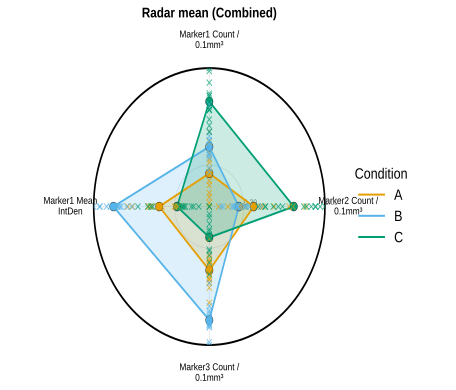 <code>plot_radar</code></a></td>
<td align="center" width="33%"><a href="../functions/plot_condition_key.md"> <code>plot_condition_key</code></a></td>
</tr>
</table>

## Distributions

<table>
<tr>
<td align="center" width="33%"><a href="../functions/plot_histograms.md">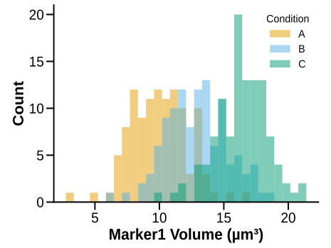 <code>plot_histograms</code></a></td>
<td align="center" width="33%"><a href="../functions/plot_ridgeline.md">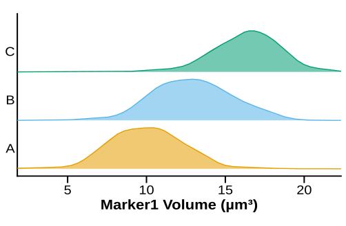 <code>plot_ridgeline</code></a></td>
<td align="center" width="33%"><a href="../functions/plot_ecdf.md">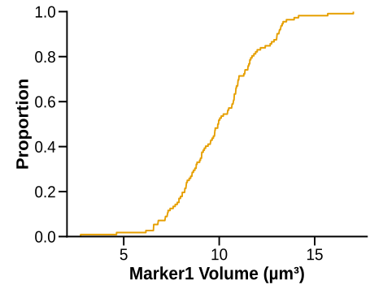 <code>plot_ecdf</code></a></td>
</tr>
<tr>
<td align="center" width="33%"><a href="../functions/plot_pie_charts.md">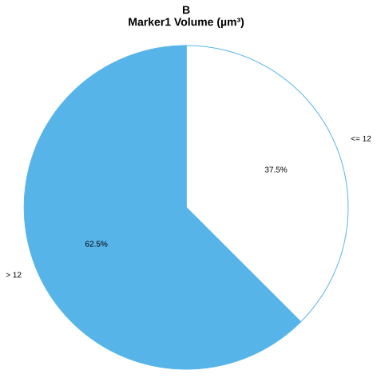 <code>plot_pie_charts</code></a></td>
<td align="center" width="33%"><a href="../functions/plot_combo_pies.md">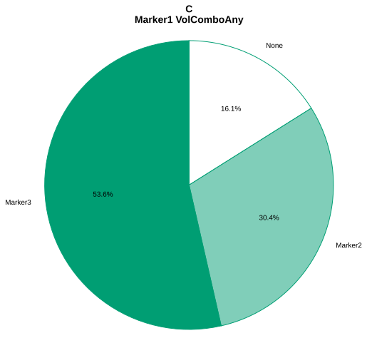 <code>plot_combo_pies</code></a></td>
</tr>
</table>

## Matrix and correlation

<table>
<tr>
<td align="center" width="33%"><a href="../functions/plot_matrices.md"> <code>plot_matrices</code></a></td>
<td align="center" width="33%"><a href="../functions/plot_rect_matrices.md"> <code>plot_rect_matrices</code></a></td>
<td align="center" width="33%"><a href="../functions/plot_matrix_differences.md"> <code>plot_matrix_differences</code></a></td>
</tr>
</table>

## Regression and model summary

<table>
<tr>
<td align="center" width="33%"><a href="../functions/plot_regressions.md"> <code>plot_regressions</code></a></td>
<td align="center" width="33%"><a href="../functions/plot_multivariable_regression_matrix.md"> <code>plot_multivariable_regression_matrix</code></a></td>
<td align="center" width="33%"><a href="../functions/plot_scatter_3d.md">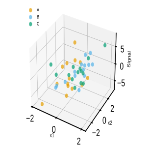 <code>plot_scatter_3d</code></a></td>
</tr>
<tr>
<td align="center" width="33%"><a href="../functions/plot_marker_pca.md"> <code>plot_marker_pca</code></a></td>
<td align="center" width="33%"><a href="../functions/plot_volcano.md"> <code>plot_volcano</code></a></td>
<td align="center" width="33%"><a href="../functions/plot_power_curve.md">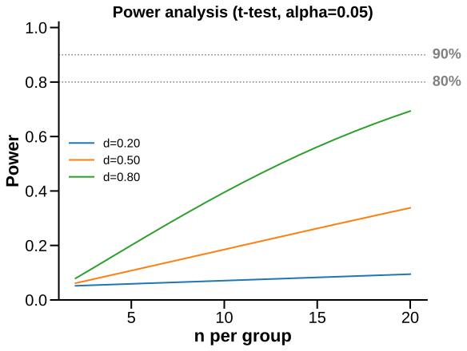 <code>plot_power_curve</code></a></td>
</tr>
</table>

## Spatial and colocalisation

<table>
<tr>
<td align="center" width="33%"><a href="../functions/plot_locations.md">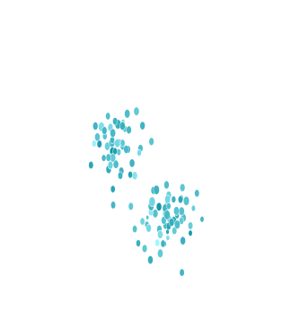 <code>plot_locations</code></a></td>
<td align="center" width="33%"><a href="../functions/plot_coloc_upset.md">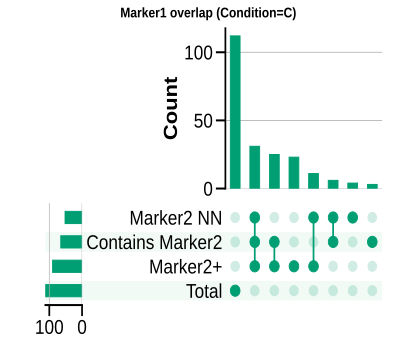 <code>plot_coloc_upset</code></a></td>
<td align="center" width="33%"><a href="../functions/plot_coloc_sankey.md"> <code>plot_coloc_sankey</code></a></td>
</tr>
</table>

## Rhythm

<table>
<tr>
<td align="center" width="33%"><a href="../functions/plot_cosinor.md">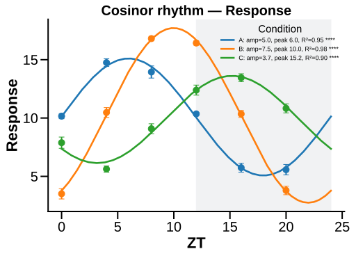 <code>plot_cosinor</code></a></td>
<td align="center" width="33%"><a href="../functions/plot_acrophase_clock.md">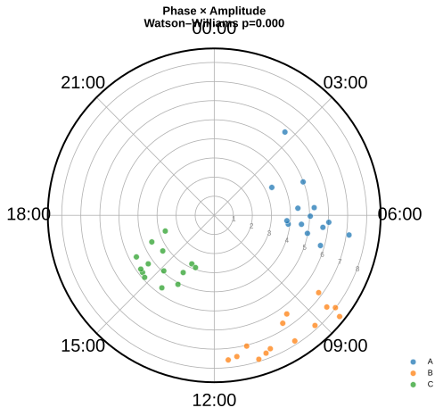 <code>plot_acrophase_clock</code></a></td>
<td align="center" width="33%"><a href="../functions/plot_timecourse.md">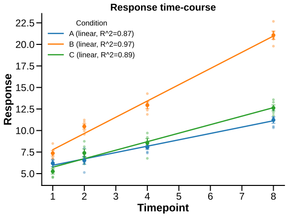 <code>plot_timecourse</code></a></td>
</tr>
</table>

## See Also

- [Example dataset](../examples/README.md)
- [Plot types](../plot-types/README.md)
- [API reference](../api-reference.md)

